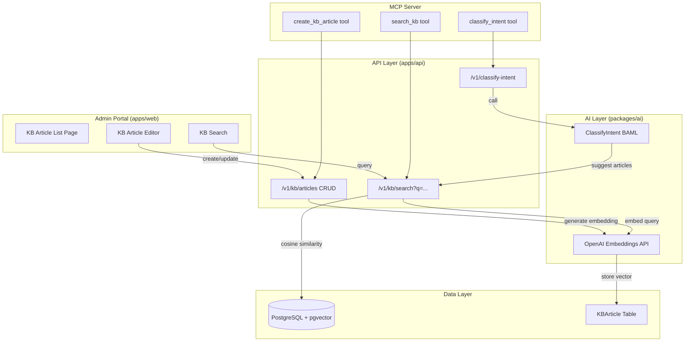

# Feature: Knowledge Base with RAG and Intent Classification

Issue: #100
Owner: Claude (feature-specification job)

## Customer

CX program managers and support team leads at mid-market companies ($10M-$500M revenue) who need their AI support systems to give accurate, context-aware answers to customer questions. Today they have feedback analysis (sentiment, topics, clusters) but no structured knowledge their AI can reference, and no way to understand what a customer actually wants when they write a message.

## Customer's Desired Outcome

When a customer sends a message like "I was charged twice for my last order", the system should:
1. Classify the intent as "billing" with high confidence
2. Retrieve the most relevant KB articles about duplicate charges and refund processes
3. Suggest a response outline grounded in the brand's actual policies

This enables Phase D (AI Support Widget) to provide accurate, brand-specific answers rather than generic LLM responses.

## Customer Problem Being Solved

Today, when a customer submits feedback or sends a support query:
1. `AnalyzeFeedback` BAML extracts sentiment, topics, and a summary
2. Alert rules can route based on topic/sentiment to a human
3. But the system has no knowledge of the brand's policies, FAQs, or troubleshooting guides
4. There is no way to understand the customer's intent (are they asking a question? filing a complaint? requesting a refund?)
5. The AI cannot suggest specific, accurate answers because it has no brand-specific knowledge to draw from

This means:
- AI responses are generic and ungrounded, leading to hallucinated answers
- Human agents must manually look up policies for every interaction
- No semantic search capability to find relevant information quickly
- No structured way to manage and update support knowledge
- No understanding of customer intent to route queries appropriately

## User Experience That Will Solve the Problem

### UX Flow

#### 1. Admin Manages Knowledge Base (`/admin/kb`)

Admin navigates to the Knowledge Base section in the admin portal:

**Article List View:**
- Table showing all KB articles: title, category, tags, status (draft/published), last updated
- Search bar with full-text search across titles and body content
- Filter by category and tags
- "Create Article" button

**Article Editor:**
- Title field (required)
- Category dropdown: FAQ, Policy, Troubleshooting, Product Guide, Process, Other
- Tags: multi-select chip input (e.g., "billing", "shipping", "returns")
- Body: Markdown editor with preview (supports headers, lists, links, code blocks)
- Status toggle: Draft / Published (only published articles appear in search results)
- Save triggers embedding generation in the background
- Visual indicator when embedding is being generated/updated

**Article Detail View:**
- Full rendered article content
- Metadata sidebar: category, tags, created date, last updated, embedding status
- Edit and Delete (soft delete) buttons

#### 2. Semantic Search for Articles

**Admin Search (`/admin/kb` search bar):**
- Standard text search for article management

**API Semantic Search (`GET /v1/kb/search?q=...`):**
- Accepts natural language query
- Generates embedding for the query via OpenAI
- Returns top-K articles ranked by cosine similarity
- Each result includes: article ID, title, category, relevance score, body snippet

**MCP Tool (`search_kb`):**
- LLM agents can search the KB using natural language
- Returns structured results for AI consumption

#### 3. Intent Classification (API + MCP)

**API Endpoint (`POST /v1/classify-intent`):**
- Accepts free text customer message
- Returns structured classification:
  - Primary intent (billing, shipping, product_question, complaint, feature_request, praise, general_inquiry, account_management, returns_refunds)
  - Confidence score (0.0 to 1.0)
  - Urgency level (low, medium, high, critical)
  - Suggested KB article IDs (top 3 most relevant)
  - Suggested response outline

**MCP Tool (`classify_intent`):**
- LLM agents can classify customer messages
- Combines intent detection with KB article suggestions

**BAML Function (`ClassifyIntent`):**
- Follows `AnalyzeFeedback` pattern in `packages/ai/baml_src/`
- Uses GPT-4o-mini for cost efficiency
- Takes customer message text + optional existing KB article summaries
- Returns typed `IntentClassification` object

#### 4. MCP Tool: Create KB Article (`create_kb_article`)

- LLM agents can programmatically create KB articles
- Useful for auto-generating articles from resolved support cases
- Validates required fields, triggers embedding generation

### Data Flow



### Acceptance Criteria

- **AC1**: Admin can create, read, update, and soft-delete KB articles via the admin portal
- **AC2**: Each KB article has: title, body (Markdown), category, tags, brandId, embedding vector, status (draft/published)
- **AC3**: Saving/updating an article automatically generates an OpenAI embedding stored in the database
- **AC4**: `GET /v1/kb/search?q=how do I get a refund` returns articles ranked by semantic relevance with scores
- **AC5**: Only published, non-deleted articles appear in search results
- **AC6**: `POST /v1/classify-intent` with body `{"text": "I was charged twice"}` returns `{"intent": "billing", "confidence": 0.92, "urgency": "high", ...}`
- **AC7**: Intent classification suggests top 3 relevant KB article IDs when articles exist
- **AC8**: All endpoints enforce `brandId` scoping from JWT (no cross-tenant data access)
- **AC9**: MCP tools `search_kb`, `create_kb_article`, `classify_intent` are registered and functional
- **AC10**: Tests cover: article CRUD, embedding generation, semantic search relevance ordering, intent classification accuracy across intent types

### Error States

| Scenario | Behavior |
|----------|----------|
| OpenAI API key missing | Embedding generation fails with clear error; article is saved without embedding; admin sees "Embedding pending" status |
| OpenAI API rate limit | Retry with exponential backoff via BullMQ queue; article saved immediately, embedding generated async |
| Empty KB search | Return empty array with 200 status, not an error |
| Search query too long (>8000 tokens) | Return 422 with "Query too long" message |
| Intent classification with no KB articles | Return classification without KB suggestions; `suggestedArticleIds` is empty array |
| Duplicate article title within brand | Allow (titles are not unique identifiers) |
| Delete article referenced by intent suggestions | Soft delete; article excluded from future search/suggestions |
| Invalid Markdown in article body | Accept as-is (Markdown rendering handles gracefully) |
| pgvector extension not available | Fail loudly at migration time with clear error message about required extension |

## Requirements

### Functional Requirements

| ID | Requirement | Acceptance Criteria |
|----|------------|---------------------|
| R1 | The system SHALL store KB articles with title, body (Markdown), category, tags, brandId, and embedding vector | Given a valid article payload, When POST /v1/kb/articles is called, Then the article is persisted with all fields and a 201 response is returned |
| R2 | The system SHALL provide CRUD operations for KB articles at /v1/kb/articles | Given an authenticated admin, When they create/read/update/delete articles, Then standard REST semantics apply with pagination on list |
| R3 | The system SHALL generate an OpenAI embedding for each article on create and update | Given an article is saved, When the save completes, Then an embedding is generated via OpenAI text-embedding-3-small and stored on the article record |
| R4 | The system SHALL provide semantic search via GET /v1/kb/search?q=... | Given a natural language query, When the search endpoint is called, Then the query is embedded and compared via cosine similarity, returning top-K articles ranked by relevance |
| R5 | The ClassifyIntent BAML function SHALL classify free text into intent categories with confidence scores | Given customer message text, When ClassifyIntent is called, Then it returns primary_intent, confidence (0-1), urgency (low/medium/high/critical), suggested_article_ids, and response_outline |
| R6 | The intent classification SHALL suggest relevant KB article IDs when a KB exists for the brand | Given a brand with published KB articles, When ClassifyIntent runs, Then it includes up to 3 relevant article IDs in the response |
| R7 | The system SHALL expose MCP tools: search_kb, create_kb_article, classify_intent | Given the MCP server is running, When an LLM agent calls these tools, Then they proxy to the corresponding API endpoints and return structured results |
| R8 | All KB and intent endpoints SHALL enforce multi-tenant scoping via brandId from JWT | Given a request with a valid JWT, When any KB/intent endpoint is called, Then brandId is extracted from the JWT and all queries are scoped to that brand |

### Data Constraints

| ID | Constraint |
|----|-----------|
| D1 | KBArticle.brandId is required (project rule #6: brandId on everything) |
| D2 | Embedding vector stored using pgvector extension (vector type, 1536 dimensions for text-embedding-3-small) |
| D3 | KBArticle uses soft delete via deletedAt field (project rule #13: GDPR/CCPA) |
| D4 | KBArticle.category is an enum: FAQ, POLICY, TROUBLESHOOTING, PRODUCT_GUIDE, PROCESS, OTHER |

### Non-Functional Requirements

| ID | Requirement |
|----|------------|
| NF1 | Semantic search latency SHALL be under 500ms for queries against up to 10,000 articles per brand |
| NF2 | Embedding generation SHALL be queued via BullMQ for resilience against OpenAI API failures |
| NF3 | Intent classification SHALL complete within 3 seconds for real-time support use |
| NF4 | The system SHALL use text-embedding-3-small (1536 dimensions) for cost efficiency at $0.02/1M tokens |

## Compliance Requirements

Based on the project's `fraim/config.json` compliance settings (GDPR: true, CCPA: true, SOC2: target):

| Control | Requirement | Implementation |
|---------|------------|----------------|
| GDPR/CCPA Soft Delete | KB articles must use soft deletes, never hard delete | `deletedAt` field on KBArticle; all queries filter `deletedAt IS NULL` |
| GDPR Data Minimization | KB articles should not contain customer PII | Admin guidance in UI; articles are brand-authored content (policies, FAQs) not customer data |
| SOC2 Audit Trail | KB article modifications must be audit-logged | Use existing `AuditEvent` model for create/update/delete actions |
| Multi-Tenant Isolation | No cross-tenant data access for KB or intent classification | brandId scoping enforced by Prisma middleware + explicit where clauses |
| OpenAI Data Processing | Customer messages sent to OpenAI for embeddings and intent classification | Document in privacy policy; no PII stored in embeddings; OpenAI data processing agreement required |

**Note:** Compliance requirements were inferred from `fraim/config.json` project context (`gdpr: true`, `ccpa: true`, `soc2: target-month-12`). No formal compliance regulations were configured in the FRAIM compliance settings.

## Validation Plan

### API Validation
1. Create a KB article via `POST /v1/kb/articles` and verify embedding is generated
2. Search via `GET /v1/kb/search?q=refund policy` and verify the refund article ranks highest
3. Classify intent via `POST /v1/classify-intent` with "I was charged twice" and verify billing intent
4. Verify multi-tenant isolation: create articles under brand A, search from brand B context returns zero results

### Browser Validation
1. Navigate to `/admin/kb` and verify article list page renders
2. Create an article with Markdown body, verify it saves and shows "embedding generated" status
3. Edit an article and verify embedding is regenerated
4. Delete an article and verify it no longer appears in list or search

### MCP Validation
1. Call `search_kb` tool with a natural language query and verify relevant results
2. Call `create_kb_article` and verify article is created with embedding
3. Call `classify_intent` with sample customer messages and verify structured response

### Test Coverage (per project rule #9 — P1 feature: unit + integration)
- **Unit tests**: Article CRUD validation, embedding generation mock, search ranking logic, intent BAML eval
- **Integration tests**: Full API flow with real DB (article CRUD, search with pgvector, intent classification)
- **BAML eval tests**: Intent classification accuracy across 10+ sample messages covering all intent types

### Compliance Validation
- Verify soft delete: deleted articles return 404 on GET but exist in DB with deletedAt set
- Verify audit events: each KB mutation creates an AuditEvent record
- Verify tenant isolation: API returns 404 (not 403) for cross-tenant article access attempts

## Alternatives

| Alternative | Why Discard? |
|-------------|-------------|
| Use external vector DB (Pinecone, Weaviate) instead of pgvector | Adds infrastructure complexity and cost; pgvector is sufficient for MVP scale (<100K articles); keeps data co-located with relational data; avoids sync issues |
| Use text-embedding-3-large (3072 dims) instead of small (1536 dims) | 2x storage and compute cost for marginal quality improvement; small model is sufficient for KB article retrieval; can upgrade later if quality is insufficient |
| Store embeddings as JSONB array instead of pgvector | Cosine similarity in application code is O(n) per query; pgvector provides indexed vector search; JSONB approach does not scale past a few hundred articles |
| Use a separate intent classification service (Dialogflow, Rasa) | Adds external dependency; BAML function pattern already proven in codebase; GPT-4o-mini is cost-effective; keeps AI layer unified |
| Rich text editor (TipTap/Slate) instead of Markdown | Higher complexity for article authoring; Markdown is simpler, portable, and sufficient for KB articles; rendered output is clean |
| Full-text search (PostgreSQL tsvector) instead of semantic search | Full-text search is keyword-based and misses semantic meaning; "how to return an item" would not match an article titled "Refund Policy"; semantic search is the core value proposition |

## Competitive Analysis

### Configured Competitors Analysis

No competitors are configured in `fraim/config.json`. Analysis based on market research of CX-loyalty and support platforms.

### Additional Competitors Analysis

| Competitor | Current Solution | Strengths | Weaknesses | Customer Feedback | Market Position |
|------------|-----------------|-----------|------------|-------------------|-----------------|
| Zendesk Guide + Advanced AI | Full KB with RAG-powered generative search. Acquired Unleash (Dec 2025) for enterprise RAG search. Advanced AI add-on ($50/agent/mo) adds intelligent triage and generative responses. Same RAG pipeline powers AI Agents, generative search, and quick answers. | Mature product, unified RAG across all surfaces, large ecosystem, enterprise-grade | Expensive: Suite Professional $115/agent/mo + Advanced AI $50/agent/mo = $165+/agent/mo. Complex setup. No loyalty integration. Real costs 2-3x advertised price with add-ons. | Users report improved answer consistency after 2026 RAG unification | Market leader in support (~15% market share) |
| Intercom Fin AI Engine | Proprietary `fin-cx-retrieval` model for RAG across help center articles, resolved conversations, PDFs, and webpages. Intent classification distinguishes knowledge retrieval vs action requests. Specialized sub-models for retrieval, ranking, summarization, escalation. 50-80% deflection rates. | Excellent UX, fast setup, strong AI quality, outcome-based pricing transparency | $0.99/resolution with 50/mo minimum. No loyalty integration. Costs scale unpredictably with volume. Optimized for B2C chat, less suited for B2B CX workflows. | "Works great for routine queries but escalation handling needs improvement" | Strong in SMB/mid-market, growing enterprise |
| Freshdesk Freddy AI | KB with intent detection, keyword analysis for auto-categorization, agent copilot for response drafting and ticket summarization. Freddy searches KB articles matching detected intent. | Affordable (included in plans), good integration suite, agent-assist copilot | AI quality lower than OpenAI/Anthropic-based solutions. Highly optimized for content within Freshdesk only — external KB content poorly supported. Limited RAG sophistication. | "Good value but AI needs improvement for complex queries" | Budget-friendly alternative, strong in India/APAC |
| Annex Cloud (direct loyalty competitor) | No KB or AI support features whatsoever | Strong loyalty program engine, deep enterprise loyalty features | Zero support/AI capabilities, no knowledge management, no intent classification | N/A — not comparable on this feature | Loyalty-only player, no CX intelligence |

### Competitive Positioning Strategy

#### Our Differentiation
- **Unified CX-Loyalty-Support**: KB and intent classification are integrated with the loyalty engine — a complaint classified as "billing" can automatically trigger a loyalty recovery campaign (Phase D)
- **Brand-Specific AI Grounding**: Unlike generic AI chatbots, responses are grounded in the brand's actual KB articles, reducing hallucination
- **Cost-Effective AI**: OpenAI embeddings + GPT-4o-mini are 10-50x cheaper than Zendesk/Intercom per-resolution pricing
- **MCP-Native**: LLM agents can directly access KB search and intent classification via MCP tools, enabling agentic workflows

#### Competitive Response Strategy
- **If Zendesk adds loyalty integration**: Our advantage is the real-time feedback-to-action loop (<15 min SLA) that Zendesk cannot replicate without rebuilding their architecture
- **If Intercom reduces pricing**: Our per-tenant model with self-hosted AI is fundamentally cheaper at scale

#### Market Positioning
- **Target Segment**: Mid-market companies ($10M-$500M) who want unified CX + loyalty + support, not three separate vendor contracts
- **Value Proposition**: One platform that understands customer intent, knows the brand's policies, AND can automatically reward or recover customers
- **Pricing Strategy**: Included in platform tier (not per-resolution), making AI support economically viable at scale

### Research Sources
- [Zendesk AI Knowledge Base Guide](https://www.zendesk.com/service/help-center/ai-knowledge-base/) — Zendesk official KB + AI documentation
- [Zendesk Pricing 2026](https://www.zendesk.com/pricing/) — Suite Team $55, Professional $115, Enterprise $169/agent/mo
- [Zendesk Acquires Unleash for RAG Search](https://www.cmswire.com/customer-experience/zendesk-acquires-unleash-for-generative-ai-rag-knowledge-search/) — Dec 2025 acquisition
- [Zendesk Generative Search Improvements](https://support.zendesk.com/hc/en-us/articles/10335440482970) — Unified RAG pipeline announcement
- [Intercom Fin AI Engine](https://fin.ai/ai-engine) — Proprietary fin-cx-retrieval model details
- [Intercom Fin Pricing](https://fin.ai/pricing) — $0.99/resolution, 50/mo minimum
- [Intercom Fin AI Agent Explained](https://www.intercom.com/help/en/articles/7120684-fin-ai-agent-explained) — Architecture and capabilities
- [Freshdesk Freddy AI Overview](https://support.freshdesk.com/support/solutions/articles/50000010359) — Intent detection, KB search, copilot features
- [Freshdesk Freddy AI Complete Guide 2026](https://myaskai.com/blog/freshdesk-freddy-ai-agent-complete-guide-2026) — Limitations and KB optimization
- Date of research: 2026-04-03
- Research methodology: Web research of competitor documentation, pricing pages, and third-party reviews

## Prisma Schema Changes

```prisma
// New enum for KB article categories
enum KBArticleCategory {
  FAQ
  POLICY
  TROUBLESHOOTING
  PRODUCT_GUIDE
  PROCESS
  OTHER
}

// New enum for article status
enum KBArticleStatus {
  DRAFT
  PUBLISHED
}

// New model: Knowledge Base Article
model KBArticle {
  id          String            @id @default(cuid())
  brandId     String
  title       String
  body        String            // Markdown content
  category    KBArticleCategory @default(FAQ)
  tags        String[]
  status      KBArticleStatus   @default(DRAFT)
  embedding   Unsupported("vector(1536)")? // pgvector — nullable until embedding is generated
  deletedAt   DateTime?         // soft delete (GDPR/CCPA)
  createdAt   DateTime          @default(now())
  updatedAt   DateTime          @updatedAt

  @@index([brandId, status])
  @@index([brandId, category])
  @@map("kb_articles")
}
```

**Migration notes:**
- Requires `CREATE EXTENSION IF NOT EXISTS vector;` in a pre-migration SQL step
- The `Unsupported("vector(1536)")` type is Prisma's way to use pgvector; raw SQL needed for the cosine similarity query
- Index on embedding vector: `CREATE INDEX kb_articles_embedding_idx ON kb_articles USING ivfflat (embedding vector_cosine_ops) WITH (lists = 100);` (add after sufficient data exists)

## BAML Function Design

```baml
// Intent classification for customer support messages

class IntentClassification {
  primary_intent string @description("One of: billing, shipping, product_question, complaint, feature_request, praise, general_inquiry, account_management, returns_refunds")
  confidence float @description("Confidence score 0.0 to 1.0")
  urgency string @description("One of: low, medium, high, critical")
  suggested_article_ids string[] @description("Up to 3 KB article IDs most relevant to this intent")
  response_outline string @description("Brief outline of how to respond to this message")
  reasoning string @description("Brief explanation of why this intent was chosen")
}

class KBArticleSummary {
  id string
  title string
  category string
}

function ClassifyIntent(
  message: string @description("The customer's message to classify"),
  kb_articles: KBArticleSummary[] @description("Available KB articles for this brand")
) -> IntentClassification {
  client GPT4oMini
  prompt #"
    You are a customer support intent classifier. Analyze the customer message and determine their intent.

    Customer message:
    ---
    {{ message }}
    ---

    
    Available knowledge base articles:
    
    - ID: {{ article.id }} | Title: {{ article.title }} | Category: {{ article.category }}
    

    Select up to 3 most relevant article IDs for suggested_article_ids.
    
    No knowledge base articles available. Leave suggested_article_ids empty.
    

    Classify the intent, assess urgency, and suggest a response approach.

    {{ ctx.output_format }}
  "#
}
```

## API Endpoints

| Method | Path | Description | Auth |
|--------|------|-------------|------|
| POST | `/v1/kb/articles` | Create KB article | JWT (admin) |
| GET | `/v1/kb/articles` | List KB articles (paginated, filterable) | JWT (admin) |
| GET | `/v1/kb/articles/:id` | Get single KB article | JWT (admin) |
| PUT | `/v1/kb/articles/:id` | Update KB article | JWT (admin) |
| DELETE | `/v1/kb/articles/:id` | Soft-delete KB article | JWT (admin) |
| GET | `/v1/kb/search` | Semantic search (`?q=...&limit=5`) | JWT (admin) |
| POST | `/v1/classify-intent` | Classify customer message intent | JWT (admin) |

## MCP Tools

| Tool | Description | Parameters |
|------|-------------|------------|
| `search_kb` | Search knowledge base articles by natural language query | `query: string`, `limit?: number` (default 5) |
| `create_kb_article` | Create a new KB article | `title: string`, `body: string`, `category: string`, `tags: string[]` |
| `classify_intent` | Classify customer message intent with KB suggestions | `message: string` |

## Design Standards

UI mocks follow the **generic UI baseline** (no project-specific design system configured). The admin KB pages use the existing shadcn/ui + Tailwind v4 patterns established in the admin portal (table components, form inputs, buttons, card layouts) as seen in `/admin/surveys`, `/admin/alerts/rules`, and `/admin/campaigns`.
