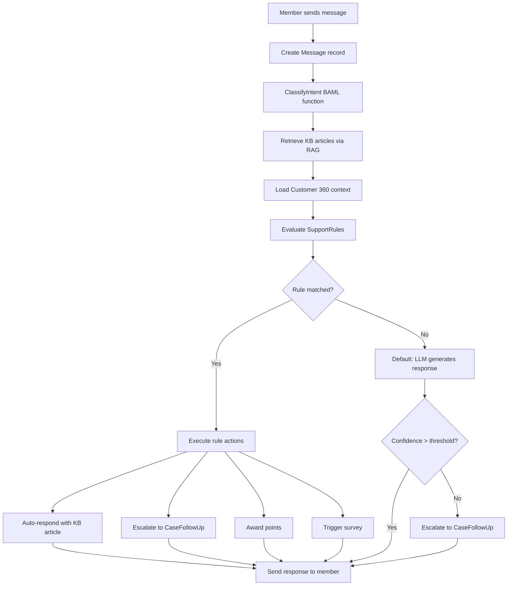

# Feature: Support Widget — Embeddable Chat with Rule-Based Response Engine

Issue: #101
Owner: Claude (feature-specification job)

## Customer

Mid-market CX program managers and customer support leads who use CustomerEQ to manage loyalty programs and survey feedback. They need a way to provide real-time, AI-powered support to their end customers (loyalty program members) without building a separate support infrastructure. Their end customers — loyalty program members visiting brand websites — need immediate answers about their points balance, rewards, program rules, and general product questions.

## Customer's Desired Outcome

Brand admins can embed a single `<ceq-support-chat>` tag on their website that gives their customers an AI-powered chat experience. The chat widget uses the full CustomerEQ intelligence stack — Customer 360 data, health scores, knowledge base articles, and intent classification — to provide personalized, context-aware responses. When the AI cannot confidently answer, it escalates to a human agent via the existing CaseFollowUp system. Brand admins configure no-code automation rules that control how different types of queries are handled based on customer tier, intent, health score, and topic.

## Customer Problem Being Solved

Today, when a loyalty program member has a question ("Where are my points?", "How do I redeem?", "Why was my tier downgraded?"):
1. There is no in-context support channel — the member must find a "Contact Us" page or send an email
2. The support agent has no visibility into the member's loyalty data (points, tier, survey history, sentiment)
3. Responses are generic — no personalization based on customer value or risk
4. There is no automation — every query, even common FAQs, requires a human to respond
5. Brand admins cannot define rules like "if a Gold tier member asks about billing, auto-respond AND escalate to their account manager"

This results in:
- Slow response times that frustrate high-value customers
- Support agents lacking context, leading to poor resolution quality
- No differentiation in support quality based on customer tier or health
- Manual handling of queries that could be automated with existing knowledge base content
- No connection between the support experience and the loyalty/CX data CustomerEQ already has

## User Experience That Will Solve the Problem

### UX Flow

#### 1. Brand Admin Installs the Widget

The admin navigates to `/admin/support/widget` and sees an installation page with:
- A code snippet: `<ceq-support-chat brand-id="brand_xxx" api-url="https://api.customereq.com"></ceq-support-chat>`
- A script tag: `<script src="https://api.customereq.com/v1/public/support/widget.js"></script>`
- Configuration options:
  - **Position**: bottom-right (default) or bottom-left
  - **Theme**: brand colors (inherits from CSS custom properties `--ceq-primary-color`, `--ceq-background-color`, `--ceq-font-family`)
  - **Welcome message**: customizable greeting text
  - **Member identification**: email lookup or JWT token (passed as `token` attribute)
  - **Operating hours**: optional schedule for when human escalation is available
- Live preview panel showing the widget with current configuration

#### 2. End Customer Interacts with the Widget

On the brand's website, the member sees a chat bubble in the bottom-right corner:
1. **Bubble state**: A circular button with a chat icon and optional unread badge
2. **Click to open**: Expands into a chat panel (400px wide, 600px tall) with:
   - Header: brand name + "Support" label + minimize button
   - Conversation thread: scrollable message history
   - Input area: text input + send button
3. **Member identification**: On first message, if no `token` attribute is set, the widget prompts for email address to link to the member's profile
4. **Message flow**:
   - Member types a message and presses Send
   - A typing indicator appears ("CustomerEQ is thinking...")
   - The AI response appears within 2-5 seconds, formatted with markdown support (bold, links, lists)
   - If a KB article is referenced, it appears as a clickable card inline
   - If the query is escalated, the member sees "I've connected you with a support agent who can help further. They'll follow up via email."
5. **Conversation persistence**: If the member closes and reopens the widget, their conversation history is restored (stored server-side, keyed by memberId + brandId)

#### 3. Message Orchestration (Backend)

When a message is received:



#### 4. Admin Configures Support Rules (`/admin/support/rules`)

Admin navigates to the support rules page and clicks "Create Rule":

- **Rule Name**: e.g., "Gold Tier Billing Escalation"
- **Priority**: 1-100 (higher = evaluated first; first matching rule wins)
- **Status**: ACTIVE / PAUSED
- **Match Conditions** (using the existing `condition-builder.tsx` component with AND/OR logic):
  - Intent: eq "billing" / contains "refund" / etc.
  - Customer tier: eq "Gold" / gte rank 3
  - Health score: lte 40 (at-risk customers)
  - Topic: contains "points" / eq "redemption"
  - Sentiment: lt -0.3 (frustrated customers)
  - Message count: gte 3 (repeated questions = escalation signal)
- **Actions** (one or more, executed in order):
  - **Auto-respond**: Select a KB article or enter a canned response template (supports `{{member.firstName}}`, `{{member.tier}}`, `{{member.pointsBalance}}` variables)
  - **Escalate**: Create a CaseFollowUp with specified priority and assignee (reuses existing CaseFollowUp model)
  - **Award points**: Grant N points as an apology gesture (enqueues a loyalty event through BullMQ)
  - **Trigger survey**: Send a satisfaction survey after resolution (enqueues via notification queue)

The rule list page shows a sortable table: Name, Priority, Status, Conditions (summary), Actions (icons), Match Count (last 30d), Created.

#### 5. Admin Views Chat Analytics (`/admin/support/analytics`)

Dashboard showing:
- **Volume**: Messages per day, conversations per day, trending up/down
- **Resolution**: % auto-resolved (no escalation), % escalated, average response time
- **Top intents**: Bar chart of classified intents (billing, shipping, product question, etc.)
- **Rule performance**: Which rules fire most often, which auto-resolutions get positive follow-up
- **Customer satisfaction**: Post-chat survey scores (if survey trigger rules are configured)

### Data Model

```
Conversation {
  id: string (cuid)
  brandId: string
  memberId: string
  status: 'ACTIVE' | 'RESOLVED' | 'ESCALATED' | 'CLOSED'
  channel: 'widget' | 'api'        // future: SMS, WhatsApp
  metadata: Json                     // { widgetVersion, pageUrl, userAgent }
  escalatedCaseId: string | null     // FK to CaseFollowUp if escalated
  resolvedAt: DateTime | null
  closedAt: DateTime | null
  createdAt: DateTime
  updatedAt: DateTime

  @@index([brandId, memberId])
  @@index([brandId, status])
  @@map("conversations")
}

Message {
  id: string (cuid)
  conversationId: string
  brandId: string
  role: 'member' | 'assistant' | 'system'  // system = escalation notices, etc.
  content: string                            // message text (markdown supported)
  
  // AI metadata (populated for assistant messages)
  intent: string | null                      // classified intent from ClassifyIntent
  confidence: float | null                   // LLM confidence score (0.0-1.0)
  kbArticleIds: string[]                     // KB articles used in response
  supportRuleId: string | null               // which SupportRule matched, if any
  
  // PII/compliance
  redactedAt: DateTime | null                // GDPR erasure timestamp
  
  createdAt: DateTime

  @@index([conversationId, createdAt])
  @@index([brandId])
  @@map("messages")
}

SupportRule {
  id: string (cuid)
  brandId: string
  name: string
  description: string | null
  priority: int @default(50)                 // 1-100, higher = evaluated first
  status: 'ACTIVE' | 'PAUSED'
  
  // Match conditions (reuses ConditionGroup type from packages/shared/src/conditions.ts)
  conditions: Json                           // ConditionGroup: { operator: 'AND'|'OR', conditions: [{ field, op, value }] }
  
  // Available condition fields:
  // - intent: string (from ClassifyIntent)
  // - tier: string (member's current tier name)
  // - tierRank: number (member's tier rank)
  // - healthScore: number (0-100)
  // - topic: string (from ClassifyIntent)
  // - sentiment: number (-1.0 to 1.0, from conversation context)
  // - messageCount: number (messages in current conversation)
  
  // Actions (executed in order)
  actions: Json                              // Array<SupportRuleAction>
  // SupportRuleAction = 
  //   { type: 'auto-respond', kbArticleId?: string, template?: string }
  // | { type: 'escalate', priority: string, assignee?: string }
  // | { type: 'award-points', points: number, reason: string }
  // | { type: 'trigger-survey', surveyId: string, delayMinutes?: number }
  
  matchCount: int @default(0)                // rolling counter for analytics
  lastMatchedAt: DateTime | null
  
  createdAt: DateTime
  updatedAt: DateTime

  @@index([brandId, status, priority])
  @@map("support_rules")
}
```

### Real-Time Communication

The widget uses **Server-Sent Events (SSE)** rather than WebSocket for real-time message delivery:
- **Why SSE over WebSocket**: Simpler server implementation (Fastify plugin), works through corporate proxies/firewalls, automatic reconnection built into the EventSource API, sufficient for a request-response chat pattern (no need for bidirectional streaming)
- **Endpoint**: `GET /v1/public/support/conversations/:id/stream` — SSE stream that emits `message` events as the AI generates responses
- **Fallback**: If SSE connection fails (e.g., old browser), the widget falls back to polling `GET /v1/public/support/conversations/:id/messages?after=:lastMessageId` every 3 seconds

### API Endpoints

| Method | Path | Auth | Purpose |
|--------|------|------|---------|
| POST | `/v1/public/support/conversations` | Public (brandId + email/token) | Start a new conversation |
| GET | `/v1/public/support/conversations/:id` | Public (member token) | Get conversation with messages |
| POST | `/v1/public/support/conversations/:id/messages` | Public (member token) | Send a message |
| GET | `/v1/public/support/conversations/:id/stream` | Public (member token) | SSE stream for real-time responses |
| GET | `/v1/support/conversations` | Admin JWT | List conversations for brand |
| GET | `/v1/support/conversations/:id` | Admin JWT | Get conversation detail |
| GET | `/v1/support/rules` | Admin JWT | List support rules |
| POST | `/v1/support/rules` | Admin JWT | Create support rule |
| PUT | `/v1/support/rules/:id` | Admin JWT | Update support rule |
| DELETE | `/v1/support/rules/:id` | Admin JWT | Delete support rule |
| GET | `/v1/support/analytics` | Admin JWT | Get support analytics |
| GET | `/v1/public/support/widget.js` | Public | Serve widget JavaScript |

### Integration Points with Existing System

1. **Customer 360** (Phase A dependency): The orchestration pipeline calls `GET /v1/members/:id/360` to inject full customer context into the LLM prompt
2. **Health Score** (Phase B dependency): Health score is available as a condition field in SupportRule matching
3. **Knowledge Base + RAG** (Phase C dependency): KB articles are retrieved via vector search and used both for auto-responses and LLM context
4. **Intent Classification** (Phase C dependency): `ClassifyIntent` BAML function classifies each incoming message
5. **CaseFollowUp** (existing): Escalation creates a new CaseFollowUp record linked to the conversation via `escalatedCaseId`
6. **BullMQ** (existing): Point awards go through `loyalty-events` queue; survey triggers go through `notifications` queue
7. **Embed package** (existing): The `<ceq-support-chat>` component follows the same Web Component + Shadow DOM pattern as `<ceq-spin-wheel>`

### Requirements

| ID | Requirement | Acceptance Criteria |
|----|-------------|---------------------|
| R1 | The system SHALL provide a `<ceq-support-chat>` web component that renders a chat bubble and expandable conversation panel | Given a page with the component tag, When the page loads, Then a chat bubble appears in the configured position |
| R2 | The widget SHALL identify the member by email lookup or JWT token attribute | Given a member with `token` attribute set, When they send a message, Then the conversation is linked to their member record |
| R3 | The system SHALL create Conversation and Message records for every chat interaction | Given a member sends a message, When the API processes it, Then a Message record with role='member' is persisted |
| R4 | The system SHALL classify each incoming message using the ClassifyIntent BAML function | Given a member message is received, When orchestration runs, Then the response Message record contains a non-null intent field |
| R5 | The system SHALL evaluate all active SupportRules against the message context using the first-match-wins pattern (ordered by priority descending) | Given active SupportRules exist, When a message is processed, Then rules are evaluated in priority order and the first match determines actions |
| R6 | The system SHALL support four action types: auto-respond, escalate, award-points, trigger-survey | Given a SupportRule with action type 'escalate', When it matches, Then a CaseFollowUp record is created with the specified priority |
| R7 | The system SHALL deliver AI responses via SSE with polling fallback | Given the SSE connection is active, When an assistant message is created, Then it is pushed to the client within 1 second |
| R8 | The system SHALL escalate to CaseFollowUp when LLM confidence is below the configured threshold (default 0.6) | Given a response with confidence 0.4, When the threshold is 0.6, Then a CaseFollowUp is created and the member is notified of escalation |
| R9 | The system SHALL persist conversation history server-side and restore it when the widget reopens | Given a member reopens the widget, When the conversation panel loads, Then previous messages are displayed |
| R10 | The system SHALL scope all data by brandId and enforce multi-tenant isolation | Given two brands, When brand A queries conversations, Then only brand A's conversations are returned |
| R11 | The admin UI SHALL provide a support rules management page at `/admin/support/rules` reusing the condition-builder.tsx component | Given an admin navigates to the rules page, When they click Create Rule, Then they see the condition builder with intent, tier, healthScore, topic, sentiment, and messageCount fields |
| R12 | The system SHALL support GDPR erasure by soft-deleting Message content and recording redactedAt | Given an erasure request for a member, When the erasure job processes it, Then all Message.content for that member is replaced with '[redacted]' and redactedAt is set |
| R13 | The system SHALL support template variables in auto-respond actions (`{{member.firstName}}`, `{{member.tier}}`, `{{member.pointsBalance}}`) | Given a rule action with template "Hi {{member.firstName}}", When the rule matches for member "Alice", Then the response contains "Hi Alice" |
| R14 | The widget SHALL be built as a Shadow DOM web component with CSS custom property theming | Given custom properties are set on the host page, When the widget renders, Then it uses those colors and fonts |

### Error States

| Scenario | Behavior |
|----------|----------|
| Member email not found | Widget creates a conversation with `memberId=null`; responses are generic (no Customer 360 context). Prompts member to verify email. |
| ClassifyIntent fails or times out | Default to intent="unknown", confidence=0.0. This will likely trigger escalation via R8. |
| KB RAG returns no results | LLM generates response without KB context; confidence may be lower. |
| SSE connection drops | Widget auto-reconnects (EventSource built-in). If reconnect fails after 3 attempts, falls back to 3-second polling. |
| LLM API (OpenAI) is unavailable | Return a system message: "I'm having trouble connecting right now. Let me get a human to help you." Auto-escalate to CaseFollowUp. |
| SupportRule action fails (e.g., point award fails) | Log error, continue with remaining actions. The response to the member is not blocked by action failures. |
| Rate limiting | Public endpoints enforce 30 messages per minute per IP. Widget shows "Please wait a moment before sending another message." |

### UI Mocks

- [Widget Chat UI (member-facing)](mocks/101-widget-chat.html) — Chat bubble, expanded panel, conversation thread, typing indicator
- [Admin Support Rules](mocks/101-admin-support-rules.html) — Rule list, rule creation form with condition builder
- [Admin Support Analytics](mocks/101-admin-support-analytics.html) — Chat volume, resolution rates, top intents, rule performance

### Design Standards Applied

This spec uses the **generic UI baseline** for mock design:
- Tailwind CSS v4 utility classes for layout and styling
- shadcn/ui (Radix primitives) patterns for form elements, dialogs, and data tables
- Consistent with existing admin pages (sidebar navigation, card-based layouts, indigo-600 primary accent)
- Widget component follows the established embed package pattern: Shadow DOM with CSS custom properties for theming

## Compliance Requirements

Compliance requirements are inferred from the project context (GDPR/CCPA rules in `project_rules.md` Rule 13) since formal compliance regulations are not configured in `fraim/config.json`:

1. **GDPR/CCPA — PII in Chat Messages**: Chat messages contain PII (member name, email, free-text content). All Message records must support soft deletion and GDPR erasure (R12). The erasure worker in `apps/worker` must be extended to zero out Message.content and set Message.redactedAt.

2. **Consent**: Conversations SHALL only be created for members with `consentGivenAt` set (existing Member field). If a non-consented member tries to chat, the widget displays a consent prompt before proceeding.

3. **Multi-Tenant Isolation**: All models (Conversation, Message, SupportRule) carry `brandId`. Prisma middleware enforces tenant scoping on every query (existing pattern per Rule 6).

4. **Data Retention**: Conversations older than the brand's configured retention period (default: 2 years) shall be eligible for automated archival/deletion via a scheduled job.

5. **No Secrets in Code**: Widget.js served from public endpoint must not embed API keys or secrets. Member authentication uses short-lived tokens only.

## Validation Plan

1. **Unit tests** (P0 — required):
   - SupportRule condition evaluation against mock message contexts
   - Template variable interpolation in auto-respond actions
   - SSE event formatting
   - Widget.js generation (follow pattern from existing survey widget tests)

2. **Integration tests** (P0 — required):
   - POST `/v1/public/support/conversations` creates Conversation record
   - POST `/v1/public/support/conversations/:id/messages` creates Message, triggers orchestration, returns response
   - SupportRule CRUD endpoints
   - Escalation creates CaseFollowUp record with correct linkage
   - Multi-tenant isolation: brand A cannot access brand B's conversations

3. **E2E tests** (P0 — required):
   - Embed widget on a test page, send a message, receive an AI response
   - Admin creates a support rule with conditions, sends a matching message, verifies rule fires
   - Escalation flow: low-confidence response creates case, member sees escalation message

4. **BAML eval tests**:
   - ClassifyIntent correctly classifies billing, shipping, product question intents
   - LLM response generation with Customer 360 context produces relevant answers

5. **Compliance validation**:
   - GDPR erasure job clears Message.content and sets redactedAt
   - Non-consented member cannot start a conversation
   - brandId scoping prevents cross-tenant data access

## Alternatives

| Alternative | Why Discard? |
|-------------|--------------|
| Integrate with third-party chat (Intercom, Zendesk Chat, Drift) | Loses the key differentiator: native access to Customer 360, health scores, loyalty data, and KB. Third-party tools would require complex data syncing and could not auto-award points or trigger surveys. |
| WebSocket instead of SSE for real-time | WebSocket adds server complexity (connection management, heartbeats, protocol upgrade handling) for a pattern that is fundamentally request-response. SSE is simpler, works through proxies, and has built-in reconnection. WebSocket would only be needed for true bidirectional streaming (e.g., typing indicators from both sides), which is not in scope. |
| Build chat as a React component (not Web Component) | Would require brand websites to have React. Web Component with Shadow DOM works on any website regardless of framework, matching the proven pattern from `<ceq-spin-wheel>`. |
| Rule engine as a separate microservice | Over-engineering for the current scale. The rule evaluation logic is a simple condition match (reuses `evaluateConditions()` from `packages/shared/src/conditions.ts`) that runs in-process during message orchestration. Extract to a service later if latency becomes an issue. |
| Build without Phase A-C dependencies (standalone) | Would produce a generic chatbot with no competitive differentiation. The entire value proposition is that responses are personalized with Customer 360 data, classified by intent, and grounded in the brand's knowledge base. |

## Competitive Analysis

### Configured Competitors Analysis

No competitors are configured in `fraim/config.json`. Analysis below is based on the CX-Loyalty platform competitive landscape.

### Additional Competitors Analysis

| Competitor | Current Solution | Strengths | Weaknesses | Customer Feedback | Market Position |
|------------|------------------|-----------|------------|-------------------|-----------------|
| Intercom | Fin AI Agent — trained on your knowledge, auto-resolves as tier-1 agent, escalates to humans. Fin Copilot add-on ($35/mo) for agent-assist. | Mature product, strong AI ($0.99/resolution pricing), rich workflow builder via Procedures, multi-channel (web, mobile, email), set up in under an hour | No native loyalty/CX integration; points, tiers, health scores not accessible to chatbot. Per-resolution pricing adds up fast at scale. Essential plan starts at $29/seat/month + $0.99/resolution. | "Great product but expensive and doesn't connect to our loyalty program" | Market leader in conversational support; $1.1B+ valuation |
| Zendesk | AI Agents (replaced Answer Bot) — autonomous support workers on chat, email, web. Intelligent Triage detects intent, language, sentiment. Voice AI in early access. | Enterprise-grade, 1000+ integrations, robust ticketing, per-automated-resolution billing verified by LLM | No native loyalty data awareness; requires Advanced AI add-on for full features; complex pricing with automated resolution charges. | "Reliable but complex pricing; AI agents improving but still behind Intercom Fin" | Enterprise support leader; public company |
| Freshdesk (Freshworks) | Freddy AI chatbot, knowledge base, workflow automations | Good mid-market pricing ($49/agent), unified CRM+support view | AI less sophisticated; no embeddable widget pattern as clean as web components; no loyalty-specific features. | "Good value but AI accuracy needs improvement" | Strong mid-market contender |
| Annex Cloud (competitor per business validation) | No chat support widget; relies on email-based support and third-party integrations | Deep loyalty feature set | No AI support, no chat, no real-time interaction capability at all | N/A | Direct loyalty competitor but no support offering |
| Yotpo | Reviews + loyalty + SMS marketing; no AI chat support | Unified reviews + loyalty; SMB-friendly | No AI chatbot; no real-time support channel; separate from support stack | "Wish loyalty and support were connected" | E-commerce loyalty leader; no support play |

### Competitive Positioning Strategy

#### Our Differentiation
- **Native CX-Loyalty Intelligence in Chat**: No competitor combines Customer 360 data (tier, points, health score, sentiment history) with AI chat responses. Intercom/Zendesk would require building custom integrations to achieve this.
- **No-Code Rule Engine Tied to Loyalty Actions**: Support rules can auto-award points, trigger surveys, and escalate based on loyalty metrics. This is impossible in standalone chat tools without deep integration work.
- **Single Embed, Full Stack**: One `<ceq-support-chat>` tag gives brands an AI chatbot that knows the customer's loyalty status, recent feedback sentiment, and health score — no integration engineering required.

#### Competitive Response Strategy
- **If Intercom adds loyalty integrations**: Our advantage is that loyalty data is native, not synced. Real-time health scores and point awards happen in the same transaction, not via webhooks with latency.
- **If Zendesk adds AI chat improvements**: Our differentiator is the rule engine that connects support outcomes to loyalty actions (point awards, tier consideration, survey triggers).

#### Market Positioning
- **Target Segment**: Mid-market companies ($10M-$500M) that use CustomerEQ for loyalty AND want AI-powered support — the same ICP as the core platform
- **Value Proposition**: "Support that knows your customers as well as your loyalty program does"
- **Pricing Strategy**: Included in the platform tier (not per-seat like Intercom); chat volume limits by plan

### Research Sources
- [Intercom Pricing](https://www.intercom.com/pricing) — $29/seat/month + $0.99/resolution (accessed 2026-04-03)
- [Intercom Fin AI Agent Guide 2026](https://myaskai.com/blog/intercom-fin-ai-agent-complete-guide-2026) — Feature analysis (accessed 2026-04-03)
- [Zendesk AI for Customer Service](https://www.zendesk.com/service/ai/) — AI Agents replacing Answer Bot (accessed 2026-04-03)
- [Zendesk AI Chatbot Practical Guide 2026](https://www.eesel.ai/blog/zendesk-ai-chatbot) — Feature and pricing analysis (accessed 2026-04-03)
- [Best AI Chatbots for Customer Service 2026](https://www.bolddesk.com/blogs/best-ai-chatbots) — Market landscape (accessed 2026-04-03)
- CustomerEQ business validation report (`docs/business-development/business-validation-report-cx-loyalty-platform-2026-03-24.md`)
- Date of research: 2026-04-03
- Research methodology: Web search of competitor pricing pages and product documentation, feature matrix comparison, industry analyst reports
