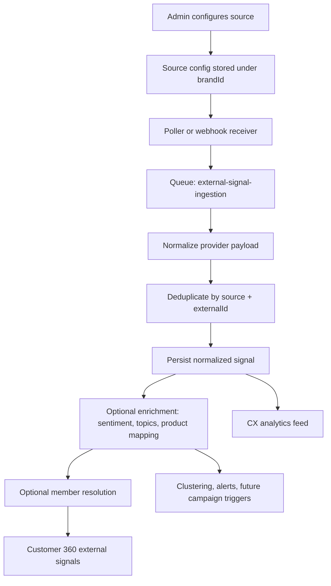

# Feature: Social Review Ingestion and External Signal Hub

Issue: #113  
Owner: Codex (feature-specification job)

## Customer

Primary users are brand admins, CX managers, and marketing operators who need CustomerEQ to capture external customer voice, not just first-party survey feedback.

They already collect surveys inside CustomerEQ, but important reputation and product signals still live outside the platform across Google reviews, Reddit threads, owned LinkedIn conversations, X mentions, and other review sites. They need those signals pulled into the same operational system that already powers Customer 360, analytics, health scoring, alerting, and loyalty actioning.

## Customer's Desired Outcome

An organization can define which external review and social channels matter to its brand or products, connect those channels with an approved ingestion method, and see the resulting normalized signals inside CustomerEQ next to surveys and loyalty activity.

The outcome is a usable 360 at three levels:
- **Brand 360**: what the market is saying overall
- **Product 360**: what people are saying about a specific product or offer
- **Customer 360**: when an external signal can be confidently matched to a known member

## Customer Problem Being Solved

Today the platform already handles surveys, survey sentiment, clustering, alerts, and Customer 360 for first-party data. But issue `#113` exposes a real gap:

1. **External voice is fragmented**: Google reviews, Reddit threads, and social comments live in third-party tools or manual spreadsheets.
2. **No unified source registry**: admins cannot tell CustomerEQ which external sources to watch, how often to sync them, or how those signals should be interpreted.
3. **No normalized external signal model**: survey responses are structured, but public review/social feedback is not yet brought into the same CX operating layer.
4. **Incomplete 360**: Customer 360 currently shows surveys, loyalty events, redemptions, campaigns, and support cases, but not external review/social signals.
5. **Missed closed-loop opportunities**: external negative sentiment can indicate churn risk or product issues, but the current system cannot operationalize it without manual export/import.

## User Experience That Will Solve the Problem

### UX Flow 1: Configure a Source on `/admin/integrations`

1. Admin opens **Integrations** and sees a new section called **Review and Social Sources**.
2. Admin clicks **Add Source** and chooses a source type:
   - Google Business Profile reviews
   - LinkedIn company-page comments and mentions
   - Reddit keyword/subreddit monitoring
   - Generic webhook/API connector
   - Future native connectors (for example X or app-store reviews)
3. Admin enters:
   - Source name
   - Scope (locations, company pages, subreddits, keywords, products, URLs)
   - Connection method (OAuth, API token, webhook, managed connector)
   - Sync mode (real-time webhook, scheduled polling, manual sync)
   - Filters (language, rating, sentiment threshold, include/exclude keywords)
   - Matching rules (brand-only, product-only, member-resolution enabled)
4. Admin tests the source and sees a preview of sample incoming items before saving.
5. Admin activates the source and sees status, last sync, records imported, and last error.

### UX Flow 2: Work the Unified Signal Feed on `/admin/analytics/cx`

1. Admin opens the CX analytics workspace and switches to **External Signals** or **All Signals**.
2. The feed shows survey responses and external reviews/social signals in one normalized list with filters for:
   - Source type
   - Channel
   - Product
   - Rating
   - Sentiment
   - Match status
   - Resolved/unresolved identity
3. Each item shows:
   - Source and channel
   - Author handle or redacted external author label
   - Rating if present
   - Sentiment, topics, and summary
   - Canonical URL back to the original source
   - Product or location association
   - Member match confidence if a known customer match exists
4. Operators can flag an item for follow-up, alerting, clustering, or future campaign targeting.

### UX Flow 3: View External Signals in Customer 360 on `/admin/members/:id`

1. Admin opens an existing Customer 360 profile.
2. A new section called **External Signals** shows matched Google reviews, Reddit posts/comments, LinkedIn comments, and webhook-delivered review signals linked to that member.
3. Each item shows:
   - Source
   - Date
   - Rating if available
   - Sentiment and topics
   - Product or location context
   - Link to original content
4. Unmatched public content stays at brand/product scope and does not appear in member 360 unless the system can resolve it with deterministic or approved high-confidence matching.

### UX Flow 4: Prepare Signals for Downstream Action

This issue is primarily about ingestion and visibility, not full automation authoring. But normalized external signals should be available for downstream systems already in the platform:
- feedback clustering
- alerting
- future campaign trigger expansion
- customer health score enrichment

**UI Mocks**: [113-view.html](mocks/113-view.html)
The current mock intentionally focuses on only two surfaces for clarity: the source configuration experience in Integrations and the matched-result experience inside Customer 360.

## Design Standards Applied

The mocks use the **generic UI baseline** because FRAIM project-specific design system configuration is not set. The layout still aligns to the existing admin product:
- dashboard-style cards
- dense operator tables
- clear status badges
- side-panel configuration patterns
- restrained neutral palette with one action color

## Requirements

### Intent Statement

CustomerEQ SHALL treat external review and social feedback as first-class CX signals by letting each brand define source configurations, ingest normalized records from approved channels, preserve source provenance, and expose those records alongside surveys and loyalty data without breaking compliance, tenant boundaries, or the event-driven architecture.

### Functional Requirements

| ID | Requirement | Acceptance Criteria |
|----|-------------|---------------------|
| R1 | The system SHALL allow a brand admin to create multiple external signal sources per brand | **Given** a brand admin, **When** they add two Google locations and one Reddit monitor, **Then** all three source configurations are stored independently under the same `brandId` |
| R2 | Each source configuration SHALL capture source type, connection method, scope definition, sync mode, filters, and enabled status | **Given** a new source form submission, **When** the source is saved, **Then** the record contains all required configuration fields and validation errors are shown for missing inputs |
| R3 | The first release SHALL let a brand ingest Google Business Profile reviews, LinkedIn owned company-page comments/mentions, Reddit monitoring, and X/Twitter content through native connectors or the generic webhook/API source where native coverage is not yet available | **Given** the source picker and mapping options, **When** the admin configures these channels, **Then** each named issue example can be represented in the source registry and normalized signal pipeline |
| R4 | The system SHALL normalize every ingested item into a common external signal record with source provenance | **Given** a Google review and a Reddit comment, **When** both are ingested, **Then** they can be queried through one common model with fields for `sourceType`, `externalId`, `body`, `rating`, `sentiment`, `canonicalUrl`, `postedAt`, and `rawPayload` |
| R5 | The system SHALL deduplicate external signals by source and provider-native ID | **Given** the same Google review notification is received twice, **When** ingestion runs, **Then** only one normalized record is stored |
| R6 | The system SHALL support brand-level storage for unresolved public content and optional product-level and member-level association when mapping rules succeed | **Given** a Reddit thread mentioning a product but no known customer, **When** ingestion completes, **Then** the signal is attached to the brand and product but not to a `Member` |
| R7 | The system SHALL expose normalized external signals in the CX analytics workspace alongside survey-derived signals | **Given** a brand with surveys and imported reviews, **When** the operator loads the CX feed, **Then** both signal types are filterable in one interface |
| R8 | Customer 360 SHALL include matched external signals for a member when the signal has a valid member association | **Given** a Google review that was matched to a known member, **When** `GET /v1/members/:id/360` is called, **Then** the response includes the external signal in a dedicated collection |
| R9 | The system SHALL expose source health and ingestion status, including last sync time, last successful import, and last error | **Given** a source that is rate-limited by the provider, **When** the admin views the integration card, **Then** the card shows the failure state and the last error message |
| R10 | The system SHALL preserve a canonical link back to the original review or social content when the provider allows it | **Given** a stored external signal, **When** an operator opens the detail view, **Then** they can navigate to the original post or review |
| R11 | The system SHALL enqueue normalization and downstream enrichment work through the queue layer rather than mutating loyalty state synchronously from the API layer | **Given** a webhook delivery or scheduled poll result, **When** the system receives raw source payloads, **Then** it enqueues ingestion and enrichment jobs before any downstream state is updated |
| R12 | The system SHALL support source-specific preview testing before activation | **Given** an unactivated source, **When** the admin clicks `Test connection`, **Then** they see sample records or a meaningful error without enabling the source |

### Data and State Constraints

| ID | Requirement | Acceptance Criteria |
|----|-------------|---------------------|
| R13 | All tenant-scoped source configurations and external signals SHALL carry `brandId` | **Given** any source or normalized signal row, **When** it is persisted, **Then** `brandId` is present and used in all read/write queries |
| R14 | The system SHALL store provider-native identifiers and raw payloads for audit and replay purposes | **Given** an ingested signal, **When** an operator investigates an issue, **Then** the original provider ID and raw payload are available for traceability |
| R15 | The system SHALL treat member matching as optional and confidence-based rather than mandatory | **Given** an author handle that cannot be confidently mapped, **When** ingestion completes, **Then** the record remains unmatched instead of attaching to the wrong member |
| R16 | The system SHALL support immutable ingestion timestamps and separate provider-posted timestamps | **Given** an imported review, **When** the record is stored, **Then** it has both `postedAt` and `ingestedAt` timestamps |
| R17 | Updates to an already-known external signal SHALL preserve history of status changes such as edited, hidden, or deleted if the provider exposes them | **Given** a review edited on the provider, **When** the next sync runs, **Then** the normalized record reflects the latest status without losing provenance |

### Non-Functional Requirements

| ID | Requirement | Acceptance Criteria |
|----|-------------|---------------------|
| R18 | Google review notifications SHALL support near-real-time ingestion when Pub/Sub notifications are configured | **Given** a Google review update, **When** notifications are enabled, **Then** the ingestion target is measured in minutes rather than batch-day latency |
| R19 | The source registry SHALL be extensible so new providers can be added without a new UX model for each connector | **Given** a future provider, **When** engineering adds a connector, **Then** it plugs into the existing source registry and normalized signal pipeline |
| R20 | External signal ingestion SHALL fail loudly with provider-specific diagnostics rather than silently dropping records | **Given** an invalid OAuth token or provider rate limit, **When** a sync fails, **Then** the operator can see the failure reason and the system logs it |

## Error States and Edge Cases

| ID | Edge Case | Expected Behavior |
|----|-----------|-------------------|
| E1 | Source credentials are invalid or expired | Source remains disabled or degraded; no records are imported; admin sees actionable error text |
| E2 | Provider returns duplicate notifications for the same review | Deduplication prevents duplicate normalized records |
| E3 | External content has no rating field (for example Reddit discussion) | Signal is still stored with `rating = null` and sentiment/topic enrichment still runs |
| E4 | Provider exposes only owned-page or first-party visibility (LinkedIn) | The UI clearly labels the source as owned-scope only; the system does not imply global keyword coverage |
| E5 | A public author cannot be matched to a member | The signal is stored at brand/product scope only |
| E6 | The same review appears through syndication or multiple providers | Records remain source-specific unless an explicit cross-source dedupe rule is configured |
| E7 | A provider deletes or hides original content after ingestion | The normalized record is retained for audit, marked as deleted/hidden if provider status is available |
| E8 | A source exceeds provider quota or rate limits | The sync job backs off, records a retry state, and surfaces the provider message in source health |

## Open Questions

1. Should native X ingestion be in the first implementation, or should the first release cover X through the generic webhook/API source because of API volatility and access restrictions?
2. What confidence threshold is required before attaching an external signal to a `Member` record instead of leaving it unresolved?
3. Should unresolved external signals be visible only in CX analytics, or also in a new brand/product-level 360 view?
4. Do we want operator reply workflows in this issue, or should this feature stop at ingestion, normalization, and visibility?

## Compliance Requirements

Compliance requirements are **inferred from project context** because formal FRAIM compliance settings are not configured for this repository. The repo rules explicitly require GDPR/CCPA handling for PII, tenant scoping, and erasure behavior.

| Control | Requirement | Implementation Direction |
|---------|-------------|--------------------------|
| C1 | External public content SHALL not be attached to a known `Member` unless matching rules are deterministic or explicitly approved | Keep unmatched content at brand/product scope; do not silently merge public authors into customer identity |
| C2 | External signal records SHALL support soft-delete or redaction behavior when a matched member exercises erasure rights | If a signal is linked to a member and subject to erasure processing, member-link fields and stored PII-derived fields must be nulled or redacted without corrupting audit provenance |
| C3 | The system SHALL minimize stored external personal data | Store only what is required for source traceability, CX analytics, and matching; avoid scraping or storing unnecessary profile fields |
| C4 | All source configs and signal queries SHALL remain brand-scoped | `brandId` is mandatory on configs, signals, jobs, and read APIs |
| C5 | The platform SHALL not rely on non-compliant scraping as the primary ingestion method | Use provider APIs, approved listening feeds, OAuth flows, or customer-controlled webhooks; scraping is not an acceptable primary architecture |
| C6 | Operators SHALL be able to see source provenance for each signal | Every normalized record must carry provider metadata and canonical URL when available |

## Proposed Data Flow

## Validation Plan

### API and Integration Validation

1. Create a source configuration per supported type and verify required validation.
2. Run `Test connection` and confirm preview data appears without activating the source.
3. Trigger a Google review import and verify the record is normalized with provider ID, rating, body, URL, and timestamps.
4. Send a webhook payload through the generic connector and verify it lands in the same normalized store.
5. Re-deliver the same payload and confirm deduplication.
6. Verify source health surfaces sync success, sync failure, and last error states.
7. Verify `GET /v1/members/:id/360` returns matched external signals only when a member association exists.

### Browser Validation

1. Open `/admin/integrations` and confirm the new source cards, add-source modal, and source health indicators render correctly.
2. Open the CX analytics view and verify external signals can be filtered by source, sentiment, rating, and match status.
3. Open Customer 360 and confirm matched signals appear as a dedicated collection with canonical links and provenance badges.

### Compliance Validation

1. Confirm unmatched public content does not automatically create or mutate `Member` records.
2. Confirm all stored records are scoped by `brandId`.
3. Trigger member erasure on a matched signal and verify member-link fields are removed or redacted according to the final implementation policy.
4. Review stored payloads and confirm only necessary external metadata is retained.

## Alternatives

| Alternative | Why discard? |
|-------------|-------------|
| Build one-off ingestion for each network with no common schema | Creates fragmented APIs and UI; impossible to query signals consistently across channels |
| Rely on scraping third-party sites as the primary ingestion mechanism | Fragile, likely non-compliant with provider terms, and contradicts the repo's browser-automation guidance for enterprise sites |
| Ingest only aggregate star ratings, not raw review/comment text | Loses sentiment, themes, and operator context needed for clustering and customer understanding |
| Force every external signal to resolve to a `Member` | Incorrectly implies identity certainty and creates avoidable privacy risk |
| Buy a full reputation-management suite instead of building normalized ingestion | Faster in the short term, but it leaves CustomerEQ without native control of the signal-to-action pipeline and weakens the product's differentiated operating model |

## Competitive Analysis

### Configured Competitors Analysis

No competitors are configured in `fraim/config.json`. The analysis below is based on current public documentation and official product pages reviewed on 2026-04-07.

### Additional Competitors Analysis

| Competitor | Current Solution | Strengths | Weaknesses | Customer Feedback | Market Position |
|------------|------------------|-----------|------------|-------------------|-----------------|
| Sprout Social | Combines review management and social listening. Reviews cover sources such as Facebook, Google Business Profile, Yelp, TripAdvisor, Trustpilot, app stores, and Glassdoor, while Listening covers sources such as Facebook, X, Instagram, LinkedIn mentions, Reddit, YouTube, Tumblr, and the Web. | Strong operator UX, unified inbox patterns, source coverage across reviews plus social, mature tagging and routing workflows | Built for social/reputation operations rather than a unified loyalty + customer data model; does not natively connect external signals to Customer 360, points, rewards, or campaign triggers | Well-regarded for workflowing and response operations; typically adopted as a standalone social-care layer | Leading mid-market and enterprise social management platform |
| Yext Reviews | Centralized review monitoring and response across Google, Facebook, Yelp, and 80+ industry sites with AI summaries and reply tooling | Very strong location/reputation management, broad site coverage, clear review operations story | Focused on review reputation and local-search visibility, not product/customer 360 or loyalty orchestration | Commonly adopted by multi-location brands for review ops at scale | Strong reputation-management player |
| Brandwatch | Combines review-site data, social, news, and forums in consumer research workflows; positions reviews as part of a holistic brand/product intelligence stack | Strong listening and research depth, broad review and discussion coverage, useful for competitor and trend analysis | Enterprise research platform, not an operational CX-loyalty product; no native member-centric 360 or loyalty-state integration | Strong for insight generation, weaker as a direct operational system of record | Enterprise social intelligence leader |
| Sprinklr | Provides enterprise listening with official Reddit firehose access, near-real-time Reddit post/comment coverage, and AI enrichment | Deep enterprise listening capability, broad data access, strong care workflows, very large-scale operations support | Complex enterprise implementation, expensive, not centered on loyalty workflows or mid-market simplicity | Known for breadth and power, often criticized for operational complexity | Enterprise unified-CXM suite |
| Bazaarvoice | Ratings and reviews network with large syndication reach, review distribution visibility, and retail/brand content network effects | Strong product-review ecosystem, network syndication, retail and commerce integration | Primarily product-review infrastructure, not cross-channel social listening or member-centric CX orchestration | Strong in retail review syndication, less relevant for unified customer intelligence | Commerce/review infrastructure leader |

### Competitive Positioning Strategy

#### Our Differentiation

- **External voice inside the same operating system as loyalty and surveys**: competitors either manage reviews/social or loyalty, but not both in the same event-driven product.
- **Customer, product, and brand 360 in one normalized model**: external signals can remain unresolved at brand/product scope or attach to a member when appropriate, which is more useful than a generic social inbox.
- **Signal-to-action path already exists**: CustomerEQ can route normalized external signals into clustering, alerting, health, and future loyalty automation instead of stopping at monitoring.

#### Competitive Response Strategy

- **If Sprout or Yext goes deeper on analytics**: emphasize that CustomerEQ is not another reputation dashboard; it is the system that joins external voice to loyalty behavior, surveys, and downstream actions.
- **If Brandwatch or Sprinklr pushes down-market**: emphasize lower workflow complexity and the fact that CustomerEQ is operational, not just analytical.
- **If Bazaarvoice adds broader listening or syndication controls**: emphasize that CustomerEQ is source-agnostic and customer-centric rather than limited to commerce-review ecosystems.

#### Market Positioning

- **Target Segment**: Mid-market brands that already collect first-party CX data but still rely on separate tools or manual processes for public review and social reputation signals.
- **Value Proposition**: Bring external reviews and social commentary into the same CX-to-loyalty operating system that already handles surveys, clustering, customer health, Customer 360, and downstream action.
- **Pricing Strategy**: Treat source ingestion as a platform expansion of CustomerEQ's unified signal layer, not as a standalone reputation-management product.

### Competitive Landscape Matrix

| Option | Category | What they cover for this problem | Pricing model | Fit vs. issue #113 |
|--------|----------|----------------------------------|---------------|--------------------|
| Sprout Social | Social + review operations | Review management plus broad social listening with one operator workflow | Public per-seat pricing starts at `Standard $199/seat/month`, with listening available as an add-on; source: official pricing page reviewed 2026-04-07 | Strong workflow benchmark; weak fit for unified loyalty/customer model |
| Yext Reviews | Reputation management | Multi-site review monitoring, filtering, notifications, and response operations | Review product availability depends on package level; official docs reference Professional package or higher; exact list pricing not public as of 2026-04-07 | Strong location-review benchmark; weaker for product/customer 360 |
| Brandwatch | Social intelligence | Broad web, review, and discussion intelligence for brand and product monitoring | Pricing not public; enterprise/demo-led as of 2026-04-07 | Strong research/listening benchmark; weaker for operational CX + loyalty execution |
| Sprinklr | Enterprise unified CXM | Large-scale social listening, including official Reddit firehose access | Pricing not public; enterprise sales motion as of 2026-04-07 | Strong data-coverage benchmark; high complexity for CustomerEQ's target market |
| Bazaarvoice | Product reviews and syndication | Ratings, reviews, distribution, and product-review analytics | Pricing not public; enterprise sales motion as of 2026-04-07 | Strong product-review benchmark; limited for cross-channel social + member 360 |
| Birdeye | Review and reputation AI | 200+ review sites, unified dashboard, AI summaries, ticketing-style review ops | Custom plans based on locations and solutions; official site points to pricing page but not a fixed public list as of 2026-04-07 | Strong multi-location review benchmark; weaker for product and loyalty intelligence |
| Podium | Local-business review growth | Review requests, Google/Facebook review collection, inbox workflows | Package-based/demo-led; official site does not publish a standard list price as of 2026-04-07 | Good local-review substitute; weak for analytics depth and normalized external-signal modeling |
| Yotpo Reviews | Commerce review stack | Product reviews, site reviews, moderation, seller-rating support, insights | Order-volume-based Pro pricing; official packaging update reviewed 2026-04-07 | Strong commerce-review benchmark; weaker for social listening and non-commerce brand voice |
| Meltwater | Social listening and consumer intelligence | Social monitoring with premium social package support for product reviews | Custom pricing by package, coverage, and scale; official pricing page reviewed 2026-04-07 | Strong listening substitute; weak for native operational customer 360 |
| Reputation.com | Reputation + social listening | Reviews, surveys, and social listening with monitor-volume tiers | Package and monitor-volume based; official offering details reviewed 2026-04-07 | Strong adjacent substitute; still separate from loyalty-state and event-driven actioning |
| Manual workflow | Spreadsheet + analyst + agency | Teams copy reviews from third-party tools into spreadsheets, then route issues manually | Labor and agency-retainer based, not software-priced | The most common "do nothing" substitute; high friction and no durable signal layer |

### Primary Recommendation and Fallbacks

- **Primary path**: Build CustomerEQ's own normalized external-signal layer and start with Google reviews, Reddit monitoring, LinkedIn owned-scope ingestion, and a generic webhook/API source.
- **Fallback path A**: If native X support is blocked by provider access or cost, keep X behind the generic connector until demand is proven.
- **Fallback path B**: If broad web listening proves too large for the first implementation, ship brand/product/member association on review-style sources first, then add broader mention streams.

### Fastest Validation Experiments

1. Pilot Google reviews plus one Reddit monitor for a single brand and measure operator usefulness against current manual workflow.
2. Test member-resolution accuracy on matched Google reviews before expanding to wider public channels.
3. Compare operator time-to-triage for external signals in CustomerEQ versus an exported spreadsheet or separate reputation tool.

### Research Sources

- [Sprout Social Reviews support article](https://support.sproutsocial.com/hc/en-us/articles/360031168531-Reviews)
- [Sprout Social Listening support article](https://support.sproutsocial.com/hc/en-us/articles/115005498146-Introduction-to-Listening)
- [Sprout Social pricing](https://sproutsocial.com/pricing/)
- [Yext Reviews product page](https://www.yext.com/platform/reviews)
- [Yext Reviews getting started](https://help.yext.com/hc/en-us/articles/48647572341915-Get-Started-with-Reviews)
- [Yext reviews monitoring and filtering](https://help.yext.com/hc/en-us/articles/48647576506907-Monitor-and-Filter-Reviews)
- [Google Business Profile review data docs](https://developers.google.com/my-business/content/review-data)
- [Google Business Profile notification setup docs](https://developers.google.com/my-business/content/notification-setup)
- [Sprinklr Reddit listening source docs](https://www.sprinklr.com/help/articles/reddit/reddit-as-a-listening-source/63e38da355780d70a15bd9fa)
- [Sprout Social LinkedIn listening guide](https://sproutsocial.com/insights/linkedin-social-listening/)
- [LinkedIn Comments API](https://learn.microsoft.com/en-us/linkedin/marketing/community-management/shares/comments-api?view=li-lms-2026-02)
- [Brandwatch Reviews data-network page](https://www.brandwatch.com/datanetworks/reviews/)
- [Brandwatch audience-analysis update](https://www.brandwatch.com/blog/next-generation-audience-analysis-brandwatch/)
- [Brandwatch Reddit access announcement](https://www.brandwatch.com/press/press-releases/brandwatch-becomes-first-social-intelligence-provider-compliantly-offer-access-reddit-data/)
- [Bazaarvoice network visibility update](https://www.bazaarvoice.com/updates/comprehensive-visibility-into-your-network-partners/)
- [Bazaarvoice Ratings and Reviews](https://www.bazaarvoice.com/products/ratings-and-reviews/)
- [Birdeye review management](https://birdeye.com/review-management/)
- [Birdeye reviews overview](https://birdeye.com/reviews/)
- [Podium reviews product overview](https://www.podium.com/sundance-spas)
- [Yotpo reviews and loyalty plan update](https://www.yotpo.com/blog/yotpos-loyalty-and-reviews-plans/)
- [Yotpo moderation workflow](https://support.yotpo.com/docs/moderating-reviews)
- [Meltwater pricing](https://www.meltwater.com/en/pricing)
- [Meltwater social monitoring overview](https://help.meltwater.com/en/articles/4064547-getting-started-with-social-media-monitoring)
- [Reputation.com product offering details](https://reputation.com/product-offering-details/)
- CustomerEQ architecture and business documents already in this repository

Research date: 2026-04-07  
Research methodology: codebase analysis plus current official product and documentation review
