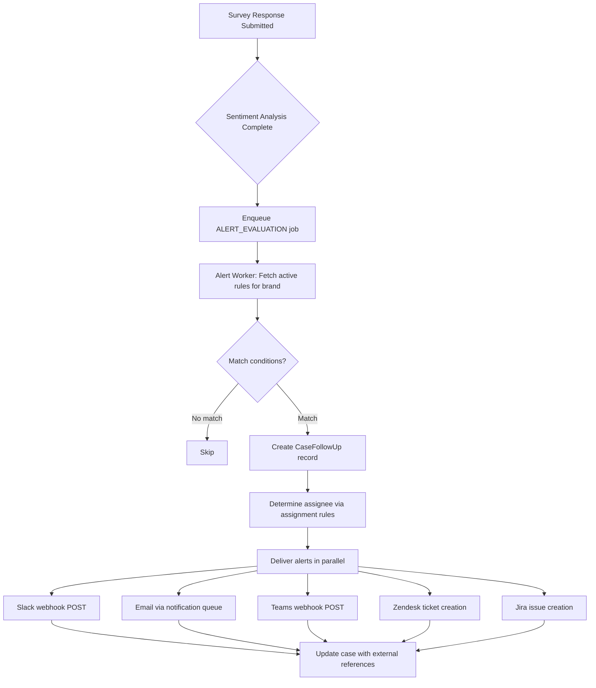

# Feature: Closed-Loop Alerting — Real-Time Alerts, Ticket Creation, Follow-Up Tracking

Issue: #41
Owner: Claude (feature-specification job)

## Customer

CX program managers who need to act on negative feedback immediately. Today they run NPS/CSAT surveys, see scores in a dashboard, but have no system to ensure someone follows up with unhappy customers. They rely on manually checking dashboards, exporting data, and sending emails — a process that takes hours or days, by which time the customer has already churned.

## Customer's Desired Outcome

When a detractor submits negative feedback, the right person is notified instantly (via Slack, email, or Teams), a case is opened with full context, and the system tracks follow-up through resolution — ensuring no unhappy customer falls through the cracks.

## Customer Problem Being Solved

Today, when a customer submits an NPS score of 2/10:
1. The response is stored in the database
2. Sentiment analysis runs and flags it as negative
3. A `cx.sentiment_negative` event is enqueued
4. ...and nothing else happens

There is no alerting, no case creation, no assignment, no follow-up tracking, and no SLA enforcement. The feedback sits in a table until someone manually checks the dashboard. This means:
- Detractors never get a response, increasing churn
- CX teams can't prove ROI of their survey programs
- No accountability for follow-up — no one knows if cases are being handled
- No visibility into response time or resolution quality

## User Experience That Will Solve the Problem

### UX Flow

#### 1. Admin Creates Alert Rules (`/admin/alerts/rules`)

Admin navigates to the alert rules page and clicks "Create Rule":

- **Rule Name**: e.g., "NPS Detractor Alert"
- **Trigger Conditions** (AND logic):
  - Survey type: NPS / CSAT / CES / Any
  - Score range: e.g., 0-6 (detractors)
  - Sentiment: below threshold (e.g., < -0.3)
  - Topics: contains any of ["shipping", "billing"] (optional)
- **Alert Channels** (one or more):
  - Slack: webhook URL + channel name
  - Email: recipient email addresses (comma-separated)
  - Teams: webhook URL
- **Ticket Integration** (optional):
  - Zendesk: subdomain + API token
  - Jira: project URL + API token + project key
- **Assignment**:
  - Default assignee (email or name)
  - Assignment rules by topic (e.g., "shipping" -> ops-lead@acme.com)
- **SLA**: Response time target in hours (e.g., 4 hours)
- **Status**: ACTIVE / PAUSED

#### 2. Alert Triggers Automatically

When a survey response matches a rule's conditions:
1. A `CaseFollowUp` record is created with status OPEN
2. Alert is delivered to configured channels:
   - **Slack**: Formatted message with respondent info, score, feedback text, and a link to the case
   - **Email**: Subject line with score + survey name, body with full context
   - **Teams**: Adaptive card with score, feedback, and action link
3. If Zendesk/Jira configured: ticket created with feedback details
4. Case assigned to the matching assignee

#### 3. Admin Manages Cases (`/admin/alerts/cases`)

Dashboard showing all cases with:
- **Columns**: Case #, Respondent, Score, Survey, Status, Assignee, SLA, Created, Last Updated
- **Filters**: Status (OPEN/CONTACTED/RESOLVED/CLOSED), Assignee, SLA compliance (On Track/Overdue), Date range
- **Status badges**: OPEN (red), CONTACTED (yellow), RESOLVED (green), CLOSED (gray), OVERDUE (pulsing red)
- Click a case to see full detail

#### 4. Case Detail (`/admin/alerts/cases/:id`)

Shows:
- Respondent info (member ID, email, score, feedback text, sentiment, topics)
- Case timeline: list of status changes with timestamps and who made them
- Action buttons: "Mark Contacted", "Mark Resolved", "Close Case", "Add Note"
- SLA indicator: time remaining or time overdue
- Link to the survey response detail page

### Data Model

```
AlertRule {
  id: string
  brandId: string
  name: string
  status: 'ACTIVE' | 'PAUSED'

  // Trigger conditions
  surveyTypes: string[]         // ['NPS', 'CSAT'] or empty = all
  scoreMin: number | null       // e.g., 0
  scoreMax: number | null       // e.g., 6
  sentimentThreshold: number | null  // e.g., -0.3 (alert if sentiment below this)
  topicFilters: string[]        // e.g., ['shipping', 'billing'] or empty = all

  // Alert channels
  slackWebhookUrl: string | null
  slackChannelName: string | null
  emailRecipients: string[]     // e.g., ['cx-team@acme.com']
  teamsWebhookUrl: string | null

  // Ticket integration
  zendeskSubdomain: string | null
  zendeskApiToken: string | null  // encrypted at rest
  jiraProjectUrl: string | null
  jiraApiToken: string | null     // encrypted at rest
  jiraProjectKey: string | null

  // Assignment
  defaultAssignee: string       // email or name
  assignmentRules: Json         // [{ topic: 'shipping', assignee: 'ops@acme.com' }]

  // SLA
  slaHours: number | null       // target response time

  createdAt: DateTime
  updatedAt: DateTime
}

CaseFollowUp {
  id: string
  brandId: string
  alertRuleId: string
  surveyResponseId: string
  memberId: string

  status: 'OPEN' | 'CONTACTED' | 'RESOLVED' | 'CLOSED'
  assignee: string
  priority: 'LOW' | 'MEDIUM' | 'HIGH' | 'CRITICAL'

  // SLA tracking
  slaDeadline: DateTime | null
  slaBreachedAt: DateTime | null

  // External references
  slackMessageTs: string | null
  zendeskTicketId: string | null
  jiraIssueKey: string | null

  // Notes/timeline
  notes: Json                    // [{ text, author, timestamp }]

  createdAt: DateTime
  updatedAt: DateTime
  contactedAt: DateTime | null
  resolvedAt: DateTime | null
  closedAt: DateTime | null
}
```

### Alert Processing Pipeline



### Integration Points with Existing System

The closed-loop alerting hooks into the existing pipeline at two points:

1. **After survey response submission** (surveys.ts / public.ts): After the response is persisted and events enqueued, also enqueue an `ALERT_EVALUATION` job with `{ surveyResponseId, brandId, memberId, score, sentiment, topics, surveyType }`

2. **After sentiment analysis** (sentimentAnalysis.ts): When sentiment analysis completes and updates the response, enqueue another `ALERT_EVALUATION` job with updated sentiment/topics (the initial evaluation may not have sentiment yet)

This ensures alerts fire even if sentiment analysis is slow, while also allowing sentiment-based rules to trigger after analysis completes.

### API Endpoints

| Method | Path | Description |
|--------|------|-------------|
| `GET` | `/v1/alert-rules` | List alert rules for the brand |
| `POST` | `/v1/alert-rules` | Create an alert rule |
| `GET` | `/v1/alert-rules/:id` | Get alert rule details |
| `PATCH` | `/v1/alert-rules/:id` | Update an alert rule |
| `DELETE` | `/v1/alert-rules/:id` | Delete an alert rule |
| `PATCH` | `/v1/alert-rules/:id/status` | Activate/pause a rule |
| `GET` | `/v1/cases` | List cases with filters (status, assignee, sla, dateRange) |
| `GET` | `/v1/cases/:id` | Get case detail with timeline |
| `PATCH` | `/v1/cases/:id/status` | Update case status (CONTACTED/RESOLVED/CLOSED) |
| `POST` | `/v1/cases/:id/notes` | Add a note to a case |

### New BullMQ Queue

```typescript
QUEUES.ALERT_EVALUATION = 'alert-evaluation'
```

Worker concurrency: 10 (same as campaign triggers — alert delivery should be fast)

### UI Mocks

- [Alert Rules & Case Management Dashboard](mocks/41-closed-loop-alerting.html)

### Design Standards Applied

Generic UI baseline: Tailwind CSS, indigo-600 primary, rounded-lg borders, text-sm base. Consistent with existing admin pages (surveys, campaigns, themes).

## Compliance Requirements

No formal compliance regulations configured. Inferred requirements:

- **Credential Security**: Zendesk/Jira API tokens and Slack/Teams webhook URLs SHALL be stored encrypted at rest. They SHALL NOT appear in API GET responses (return masked values like `****last4`).
- **PII Minimization**: Alert messages delivered to Slack/Teams SHALL include member ID and score but SHALL NOT include the member's email address by default. Email alerts to configured recipients MAY include email since they are internal team communications.
- **Audit Trail**: All case status changes SHALL be logged in the `notes` JSON array with timestamp, author, and previous/new status for accountability.
- **SLA Timestamps**: All timestamps SHALL use UTC to avoid timezone confusion in distributed teams.

## Validation Plan

| Step | Method | Expected Result |
|------|--------|-----------------|
| Create alert rule with NPS < 7 condition | API: POST /v1/alert-rules | Rule created with ACTIVE status |
| Submit NPS response with score 4 | API: POST /v1/public/surveys/:id/respond | Case created with OPEN status |
| Slack webhook receives alert | Mock webhook endpoint | POST received with formatted message |
| Email alert sent | Notification queue log | Email enqueued with correct recipient |
| Case appears in dashboard | Browser: /admin/alerts/cases | Case visible with correct score, assignee |
| Update case to CONTACTED | API: PATCH /v1/cases/:id/status | Status updated, contactedAt set |
| SLA breach detection | Wait past deadline | Case flagged as OVERDUE |
| Add note to case | API: POST /v1/cases/:id/notes | Note appears in case timeline |
| Masked credentials in GET response | API: GET /v1/alert-rules/:id | Tokens show as ****xxxx |
| Delete rule with existing cases | API: DELETE /v1/alert-rules/:id | Rule deactivated, cases preserved |

## Alternatives

| Alternative | Why Discard? |
|-------------|-------------|
| Extend existing Campaign system for alerts | Campaigns award points/rewards — different action model. Alerts need case lifecycle (OPEN->RESOLVED), external integrations, SLA tracking. Separate model is cleaner. |
| Email-only alerts (no Slack/Teams) | Enterprise teams live in Slack/Teams. Email-only alerts get buried. Multi-channel is required for adoption. |
| No case management (just fire-and-forget alerts) | Without tracking, there's no accountability. CX teams can't prove ROI or measure response times. Case management is the core value. |
| Build a full ticketing system (replace Zendesk/Jira) | Over-scoped. Integrate with existing tools rather than replacing them. Focus on the CX-specific workflow. |

## Competitive Analysis

### Additional Competitors Analysis

| Competitor | Current Solution | Strengths | Weaknesses | Customer Feedback | Market Position |
|------------|------------------|-----------|------------|-------------------|-----------------|
| Qualtrics | Full ticketing with inner loop (individual follow-up) + outer loop (aggregate insights). Automated ticket creation, Slack/CRM integration, mobile follow-up app. | Most mature closed-loop system; inner/outer loop framework; mobile app for field teams | Complex setup; expensive add-on; separate ticketing license; overkill for smaller programs | "Powerful but takes months to configure properly" | Enterprise market leader |
| Medallia | Case management with CLF volumes, SLA adherence, escalations. AI-powered routing. Framework: Detect -> Route -> Act -> Track -> Learn. | Enterprise-grade; AI routing; real-time alerts to frontline; robust SLA framework | Very expensive; complex implementation; requires Medallia ecosystem | "Best enterprise closed-loop but massive investment" | Enterprise co-leader with Qualtrics |
| AskNicely | NPS-focused alerts with workflows. Auto-respond to promoters, alert on detractors. Real-time leaderboards. | Simple NPS alerting; quick setup; leaderboards for team motivation | NPS-only; limited case management; no Zendesk/Jira integration | "Great for simple NPS programs, outgrow it fast" | SMB NPS specialist |
| Delighted | Basic alert emails on new responses. No case management or ticketing integration. | Simple; included in base plan; instant notifications | No follow-up tracking; no SLA; no integrations; no case management | "Good to know about responses but no workflow" | SMB, basic alerting only |

### Competitive Positioning Strategy

#### Our Differentiation
- **CX-to-Loyalty Loop**: When a case is resolved, CustomerEQ can automatically trigger a loyalty action (award recovery points, send a personalized offer) — no competitor connects closed-loop directly to loyalty programs.
- **AI-Powered Context**: Every alert includes AI-analyzed sentiment, extracted topics, and cluster assignment — giving responders immediate context without reading the raw feedback.
- **Built-In, Not Bolt-On**: Unlike Qualtrics (separate ticketing module) or Medallia (enterprise add-on), alerting is integrated into the core platform from day one.

#### Market Positioning
- **Target Segment**: Mid-market CX teams (50-500 employees) who need more than AskNicely/Delighted alerts but can't justify Qualtrics/Medallia enterprise pricing.
- **Value Proposition**: The only CX platform where detractor follow-up automatically connects to loyalty actions, with AI context on every case.

### Research Sources
- [Qualtrics Closed-Loop CX Management](https://www.qualtrics.com/en-gb/experience-management/customer/closed-loop-cx/)
- [Qualtrics Ticket Workflows](https://www.qualtrics.com/support/survey-platform/actions-module/ticketing/ticket-workflows/)
- [Qualtrics Following Up On Tickets](https://www.qualtrics.com/support/survey-platform/actions-module/ticketing/following-up-on-tickets/)
- [Medallia Closed-Loop Feedback Framework](https://www.medallia.com/blog/closed-loop-feedback-program-try-this-framework/)
- [Medallia Smart Closed Loop Guide](https://www.medallia.com/wp-content/uploads/pdf/resources/Medallia-The-Complete-Guide-to-Closing-the-Loop-in-Real-Time.pdf)
- Research date: 2026-03-27
- Methodology: Web research of competitor documentation, case studies, and review platforms
