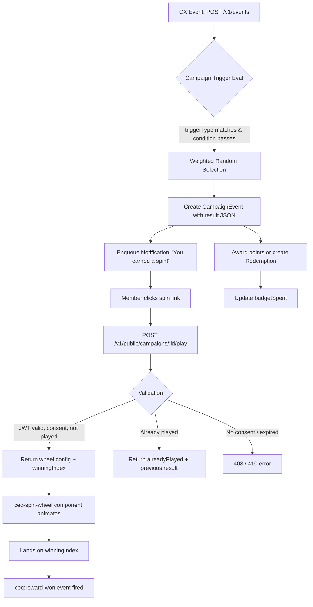

# Feature: Spin-the-Wheel Campaign — Interactive Weighted-Random Reward Selection

Issue: #83
Owner: Claude (feature-specification job)
Parent: #82 (Embeddable Campaign Components SDK)

## Customer

**Marketing Managers** at mid-market brands ($10M–$500M revenue) who run loyalty programs and want to make campaign rewards exciting, shareable, and engagement-driving — not just silent point deposits.

**Loyalty Members** (end consumers) who interact with the brand's loyalty program and want a fun, interactive reward experience that feels like winning something rather than receiving a statement credit.

## Customer's Desired Outcome

**Marketing Manager**: "I want to create a campaign where members spin a wheel to win their reward — so they feel excited, share the experience, and come back more often. I want to set the rewards and odds, see a live preview, and get an embed code I can drop into our website."

**Loyalty Member**: "After I complete a qualifying action (purchase, survey, etc.), I want to spin a colorful wheel and discover what I won. It should feel like a real game, not a loading spinner."

## Customer Problem Being Solved

Today, when a campaign triggers for a member:
1. The campaign processor silently awards points to `Member.pointsBalance`
2. A `CampaignEvent` record is created
3. If configured, a notification is enqueued
4. ...and the member sees their balance go up by some number

There is no interactive moment, no visual payoff, no shareability, and no reason to be excited. The member experience is indistinguishable from a bank statement. This means:
- Engagement rates plateau — members habituate to silent point deposits
- No viral loop — nothing shareable or screenshot-worthy
- No differentiation — every loyalty program feels the same
- Campaign ROI is invisible to members — they don't connect the reward to the action

Spin-the-wheel mechanics are proven to drive **30-50% higher engagement** than static rewards (industry benchmarks from Wheelio, Gamewheel, OptinMonster).

## User Experience That Will Solve the Problem

### UX Flow

#### 1. Admin Creates a Spin Wheel Campaign (`/admin/campaigns/new`)

Admin navigates to the campaign creation page and selects "Spin Wheel" as the action type:

**Step 1 — Campaign Basics** (existing fields):
- Campaign name (e.g., "Holiday Spin & Win")
- Program selection
- Trigger type (e.g., `cx.nps_submitted`, `purchase`)
- Trigger condition (optional, e.g., `nps_score >= 7`)
- Start date, end date
- Budget cap (optional)

**Step 2 — Wheel Configuration** (new section, appears when `actionType = "spin_wheel"`):
- **Segment builder**: Add 2–8 reward segments. Each segment has:
  - Reward: select from existing rewards catalog, or "Bonus Points" with custom amount
  - Probability: percentage (all segments must sum to 100%)
  - Label: display text on the wheel (e.g., "500 Points!", "Free Coffee", "10% Off")
  - Color: hex color picker (default palette provided)
- **Wheel style**: Classic (solid colors) | Neon (glow effects) | Minimal (thin borders)
- **Live preview**: Real-time rendering of the wheel with configured segments, colors, and labels. Admin can click "Test Spin" to see the animation.

**Step 3 — Embed & Launch**:
- After saving (status = DRAFT), admin sees:
  - Embed code snippet: `<script src="..."></script><ceq-spin-wheel campaign-id="..." token="{{MEMBER_TOKEN}}"></ceq-spin-wheel>`
  - Direct link URL for email/SMS campaigns
  - QR code (if distribution feature exists)
- Admin activates campaign (DRAFT → ACTIVE)

**Mock**: [83-admin-campaign-builder.html](mocks/83-admin-campaign-builder.html)

#### 2. Member Triggers the Campaign

A qualifying event occurs (e.g., member submits NPS survey with score >= 7):
1. Event ingested via `POST /v1/events`
2. Campaign trigger evaluates: `triggerType` matches, `triggerCondition` passes
3. Campaign processor determines the winning reward via weighted random selection
4. `CampaignEvent` created with `result` JSON storing the pre-determined outcome
5. Notification sent to member: "You've earned a spin! 🎡" with link to spin page

The result is **pre-determined server-side** at trigger time. The wheel animation is purely cosmetic — the member always lands on the already-selected reward. This prevents any client-side manipulation.

#### 3. Member Spins the Wheel

Member clicks the link or encounters the embedded `<ceq-spin-wheel>` component on the brand's site:

1. Component calls `POST /v1/public/campaigns/:id/play` with member JWT token
2. API validates:
   - Member is authenticated and has consent
   - Campaign is ACTIVE and within date range
   - Member hasn't already played this campaign (dedup)
3. API returns wheel config + pre-determined result:
   ```json
   {
     "segments": [
       { "label": "500 Points!", "color": "#4F46E5", "index": 0 },
       { "label": "Free Coffee", "color": "#10B981", "index": 1 },
       { "label": "10% Off", "color": "#F59E0B", "index": 2 },
       { "label": "100 Points", "color": "#EF4444", "index": 3 }
     ],
     "winningIndex": 1,
     "wheelStyle": "classic"
   }
   ```
4. Component renders the wheel with segments and animates the spin
5. Wheel lands on the winning segment (eased rotation to `winningIndex`)
6. Celebration animation plays (confetti, glow, text callout)
7. Component fires `ceq:reward-won` DOM event with reward details
8. Member sees: "You won: Free Coffee! ☕" with claim instructions

**Mock**: [83-member-spin-wheel.html](mocks/83-member-spin-wheel.html)

#### 4. Already-Played State

If a member revisits the spin wheel after already playing:
1. API returns `{ alreadyPlayed: true, result: { ... } }` (HTTP 200, not error)
2. Component shows the wheel in its final landed position with: "You already played! Your prize: Free Coffee ☕"
3. No re-spin allowed

### Data Model Changes

#### Modified: `CampaignEvent`
Add `result` JSON field to store the pre-determined outcome:
```
CampaignEvent {
  ...existing fields...
  result    Json?    // { winningIndex: 1, rewardId: "rwd_abc", points: 0, label: "Free Coffee" }
}
```

#### Modified: `ActionConfigSchema` (Zod)
Extend to support `spin_wheel` action type:
```
SpinWheelSegmentSchema = z.object({
  rewardId: z.string().optional(),      // null for points-only segments
  points: z.number().int().nonneg().optional(),  // for bonus-points segments
  probability: z.number().min(0).max(100),
  label: z.string().min(1).max(50),
  color: z.string().regex(/^#[0-9A-Fa-f]{6}$/),
})

SpinWheelConfigSchema = z.object({
  segments: z.array(SpinWheelSegmentSchema).min(2).max(8),
  wheelStyle: z.enum(['classic', 'neon', 'minimal']).default('classic'),
}).refine(
  data => Math.abs(data.segments.reduce((sum, s) => sum + s.probability, 0) - 100) < 0.01,
  { message: 'Segment probabilities must sum to 100%' }
)
```

#### Modified: `CreateCampaignSchema`
Extend `actionType` enum:
```
actionType: z.enum(['award_points', 'award_reward', 'send_message', 'spin_wheel'])
```
When `actionType === 'spin_wheel'`, `actionConfig` SHALL validate against `SpinWheelConfigSchema` instead of the existing `ActionConfigSchema`.

#### No New Models Required
The spin wheel reuses existing `Campaign`, `CampaignEvent`, `Reward`, and `Redemption` models. The `result` field on `CampaignEvent` and the extended `actionConfig` schema are the only structural changes.

### API Changes

#### New Endpoint: `POST /v1/public/campaigns/:id/play`

**Auth**: Member JWT token (not admin API key)
**Rate limit**: 10 requests per minute per member

**Request**: No body required. Campaign ID in URL, member identity from JWT.

**Response (success — first play)**:
```json
{
  "alreadyPlayed": false,
  "segments": [...],
  "winningIndex": 2,
  "wheelStyle": "classic",
  "reward": {
    "type": "points",
    "points": 500,
    "label": "500 Points!",
    "message": "Congratulations! 500 bonus points added to your account."
  }
}
```

**Response (already played)**:
```json
{
  "alreadyPlayed": true,
  "reward": {
    "type": "points",
    "points": 500,
    "label": "500 Points!",
    "message": "You already claimed this reward."
  }
}
```

**Error responses**:
- `401` — Missing or invalid member JWT
- `404` — Campaign not found or not ACTIVE
- `403` — Member does not have consent (`consentGivenAt` is null)
- `410` — Campaign has ended (past `endDate`)
- `429` — Rate limited

#### Modified: `POST /v1/campaigns` (admin)
Accepts `actionType: "spin_wheel"` with `actionConfig` matching `SpinWheelConfigSchema`.

#### Modified: Campaign trigger processor
When `actionType === "spin_wheel"`:
1. Perform weighted random selection from `actionConfig.segments[]`
2. Store result in `CampaignEvent.result` JSON
3. If winning segment has `rewardId` → create `Redemption` record
4. If winning segment has `points` → increment `Member.pointsBalance`
5. Update `Campaign.budgetSpent` (cost = points * pointToCurrencyRatio, or reward's pointsCost * ratio)
6. Enqueue notification with spin link

### Requirements

**R1** — The system SHALL accept `actionType: "spin_wheel"` when creating a campaign, with `actionConfig` containing an array of 2–8 segments, each with a rewardId or points amount, probability (0–100), label, and hex color.

**R2** — Segment probabilities SHALL sum to exactly 100% (within floating-point tolerance of 0.01). The API SHALL reject creation if they do not.

**R3** — When a campaign with `actionType: "spin_wheel"` triggers for a member, the system SHALL perform weighted random selection from the configured segments and store the result in `CampaignEvent.result` as JSON.

**R4** — The weighted random selection SHALL use a cryptographically secure random number generator (`crypto.randomInt` or equivalent) to prevent prediction.

**R5** — `POST /v1/public/campaigns/:id/play` SHALL validate the member's JWT, verify consent, check campaign status (ACTIVE), check date range, and enforce one-play-per-member dedup before returning the wheel config and pre-determined result.

**R6** — If the member has already played (CampaignEvent exists for this campaign + member), the play endpoint SHALL return `{ alreadyPlayed: true }` with the previously determined result (HTTP 200, not an error).

**R7** — The play endpoint SHALL return the full wheel config (all segments with labels and colors) plus the `winningIndex`, so the client component can animate the spin and land on the correct segment.

**R8** — When the winning segment specifies `points`, the system SHALL increment `Member.pointsBalance` and create a `LoyaltyEvent` record (same as existing `award_points` flow).

**R9** — When the winning segment specifies `rewardId`, the system SHALL create a `Redemption` record with status `PENDING` and decrement `Reward.stock` if stock is tracked.

**R10** — Budget tracking SHALL work for spin wheel campaigns: the cost of the winning reward (points * `pointToCurrencyRatio` or reward's `pointsCost` * ratio) SHALL be added to `Campaign.budgetSpent`. If `budgetSpent` exceeds `budgetCap`, the campaign SHALL auto-pause.

**R11** — The admin campaign creation form SHALL display a wheel segment builder when `actionType = "spin_wheel"` is selected, allowing the admin to add/remove segments, set probabilities, labels, and colors.

**R12** — The admin form SHALL display a live wheel preview that updates in real-time as segments are configured.

**R13** — The admin form SHALL validate that probabilities sum to 100% client-side before submission, displaying an inline error if they do not.

**R14** — After campaign creation, the admin SHALL see an embed code snippet and direct link URL for the spin wheel.

**R15** — The `<ceq-spin-wheel>` embeddable Web Component SHALL render a spinning wheel with the configured segments, animate the spin with easing, and land on the pre-determined winning segment.

**R16** — The `<ceq-spin-wheel>` component SHALL fire a `ceq:reward-won` CustomEvent on the DOM after the spin animation completes, with the reward details in `event.detail`.

**R17** — The `<ceq-spin-wheel>` component SHALL work on mobile devices with touch interaction (tap to spin).

**R18** — The `<ceq-spin-wheel>` component SHALL support CSS custom properties for brand theming: `--ceq-font-family`, `--ceq-primary-color`, `--ceq-background-color`.

**R19** — The play endpoint SHALL be rate-limited to 10 requests per minute per member to prevent abuse.

### Edge Cases & Error States

| Scenario | Expected Behavior |
|---|---|
| Probabilities don't sum to 100% | API rejects with 422 and message "Segment probabilities must sum to 100%" |
| Campaign is PAUSED or COMPLETED | Play endpoint returns 404 |
| Campaign endDate has passed | Play endpoint returns 410 "Campaign has ended" |
| Member has no consent | Play endpoint returns 403 |
| Member already played | Returns 200 with `alreadyPlayed: true` and previous result |
| Budget cap exceeded during trigger | Campaign auto-pauses; member's trigger is still processed (last one before pause) |
| Reward stock is 0 | If winning segment's reward has stock=0, fall back to next-highest-probability segment with available stock. If all exhausted, award the segment's label value as bonus points |
| Network error during spin animation | Component shows "Something went wrong" with retry button |
| Member JWT expired | Component shows "Session expired" with link to re-authenticate |
| 0-probability segment configured | Allowed (segment appears on wheel visually but is never selected) |

### Open Questions

- **Q1**: Should we allow multiple spins per campaign (e.g., daily spins)? Current spec is one-play-per-member based on existing `CampaignEvent` unique constraint. Could be a Phase 2 enhancement.
- **Q2**: Should the spin result be revealed only on the client (via play endpoint), or should the trigger notification already tell the member what they won? Current spec: trigger notification says "You earned a spin!" without revealing the result.

## Compliance Requirements

Compliance requirements inferred from project context (GDPR/CCPA, SOC2 — no formal regulations configured in `fraim/config.json`):

- **GDPR/CCPA**: The play endpoint SHALL verify `Member.consentGivenAt` before returning any data. Members who have been erased (`Member.erased = true`) SHALL receive a 404.
- **Data Minimization**: The play endpoint returns only wheel config and result — no PII is exposed to the embeddable component.
- **Audit Trail**: All spin results are stored in `CampaignEvent.result` with timestamps, providing full auditability.
- **Fairness**: Weighted random selection uses `crypto.randomInt` — verifiable server-side. No client-side randomization that could be manipulated.
- **SOC2 Logging**: Play endpoint access is logged with member ID, campaign ID, and timestamp.

## Design Standards

Mocks use the **generic UI baseline**: indigo/violet color scheme (`indigo-600`, `indigo-700`), Inter font family, shadcn/ui-style components. Admin UI follows existing campaign creation form patterns at `apps/web/src/app/(admin)/admin/campaigns/new/page.tsx`.

The member-facing `<ceq-spin-wheel>` component uses a neutral default theme with CSS custom properties for brand customization.

## Validation Plan

1. **API Validation**:
   - Create campaign with `actionType: "spin_wheel"` via `POST /v1/campaigns` — verify 201
   - Verify rejection when probabilities don't sum to 100% — verify 422
   - Activate campaign, ingest qualifying event — verify `CampaignEvent` created with `result` JSON
   - Call `POST /v1/public/campaigns/:id/play` — verify wheel config + winningIndex returned
   - Call play again — verify `alreadyPlayed: true` returned
   - Verify budget tracking increments correctly

2. **Browser Validation**:
   - Serve HTML mocks via `npx serve docs/feature-specs/mocks/`
   - Open admin mock — verify segment builder adds/removes segments, probabilities update, live preview renders
   - Open member mock — verify wheel spins smoothly, lands on correct segment, celebration animation plays
   - Test on mobile viewport (375px width) — verify touch-to-spin works

3. **Compliance Validation**:
   - Call play endpoint without JWT — verify 401
   - Call play endpoint for member without consent — verify 403
   - Call play endpoint for erased member — verify 404

## Alternatives

| Alternative | Why Discard? |
|---|---|
| Static random reward (no animation) | No engagement lift. Members don't feel like they "won" anything — it's just another point deposit. |
| Client-side randomization | Security risk. Members could inspect network traffic or manipulate JS to always win the best prize. Server-side pre-determination is essential. |
| Hosted spin wheel page (CustomerEQ-hosted) | Mid-market brands want to embed in their own sites, not redirect to a third-party page. Embeddable components match the product thesis. |
| Third-party spin wheel widget (Wheelio, etc.) | Adds external dependency, doesn't integrate with loyalty program data, can't auto-award points/rewards, and costs per-impression. |
| Reveal-only (no spin animation) | Scratch-off or mystery box mechanics serve this use case. Spin wheel specifically requires the spinning animation for engagement. |

## Competitive Analysis

### Configured Competitors Analysis

| Competitor | Current Solution | Strengths | Weaknesses | Market Position |
|---|---|---|---|---|
| AnnexCloud | Badges, leaderboards, contests (UC-18). No spin wheel or interactive mechanics. | Strong enterprise positioning, 125+ integrations | No interactive gamification beyond traditional badges/leaderboards. Enterprise pricing ($75K+). | Enterprise leader, no mid-market play |
| Yotpo | Points-based loyalty with referrals. No gamification features. | Strong e-commerce integration (Shopify) | No CX feedback loop, no interactive campaigns | E-commerce focused |
| Smile.io | Points, VIP tiers, referrals. No interactive mechanics. Gameball comparison shows Smile lacks gamification entirely. | Easy Shopify setup, self-serve, large merchant base | Very basic — no campaigns, no CX integration, no gamification | SMB e-commerce |
| LoyaltyLion | Points, tiers, referrals. Basic "challenges" (single-action). | Shopify native | No multi-step challenges, no interactive mechanics, no CX integration | Mid-market e-commerce |

### Additional Competitors Analysis

| Competitor | Current Solution | Strengths | Weaknesses | Pricing | Market Position |
|---|---|---|---|---|---|
| **Gameball** | Full gamification loyalty: spin wheel, scratch cards, slot machines, challenges, badges, streaks. Embeddable in-app games. | Closest direct competitor for gamified loyalty. Spin wheel is fully brandable with custom visuals, logic, and reward types. Shopify-native. | E-commerce only (Shopify/WooCommerce). No CX feedback integration (NPS/CSAT). No event-driven trigger system — games are popup-based, not CX-event-triggered. | Free tier (100 MRCs), Starter $34/mo, Pro $159/mo, Growth $399/mo, Enterprise $599/mo. API add-on $199/mo. | Leading gamified loyalty for e-commerce. 4.8★ on Shopify. |
| **Antavo** | Prize Wheel module with configurable slices, probabilities, and claim limits. Drag-and-drop Workflows editor for campaign flows. Quizzes, treasure hunts, UGC rewards. | Enterprise-grade gamification with visual workflow builder. Prize Wheel has extended reward randomization. Clubs feature for community loyalty. | Enterprise pricing (not public, estimated $30K+/year). Heavy implementation required. No embeddable components — hosted experience only. No real-time CX event triggers. | Not public — enterprise sales only. | Enterprise loyalty leader. Used by major retail brands. |
| **BRAME** | Gamification marketing platform with spin wheel, scratch cards, memory games, quizzes. Drag-and-drop campaign builder. | Purpose-built gamification UX with many game types. Strong analytics. | Not a loyalty platform — marketing/lead-gen focused. No points, tiers, or member management. No CX integration. | Not public — enterprise pricing. | Gamification marketing specialist. |
| **Wheelio** (Shopify) | Spin wheel popup for email capture + discount codes on Shopify stores. | Simple, proven UX. Quick to deploy. | One-trick widget — no loyalty platform, no member tracking, no CX integration, no points. Popup-only (not embeddable). | Shopify app pricing (~$15-50/mo). | Niche Shopify email capture widget. |
| **CataBoom** | White-label gamification platform: spin wheels, slot machines, instant wins. Used by Best Western for loyalty point awards. | Strong enterprise case studies. White-label branding. | Standalone platform — requires integration work. No native loyalty engine. No CX feedback loop. | Enterprise pricing (not public). | Enterprise promotional gaming. |
| **BeeLiked** | Spin-the-wheel as one of many promotion types. Browser-based, embeddable. | Multi-game platform. Good embed options. | Marketing promotions only — no loyalty, no member state, no CX integration. | Tiered pricing starting ~$50/mo. | Mid-market promotional tool. |

### Competitive Positioning Strategy

#### Our Differentiation
- **CX-to-Gamification Loop (Unique)**: No competitor connects CX feedback (NPS, CSAT) directly to interactive reward mechanics. A detractor's NPS score can trigger a spin wheel — that's a first. Gameball, Antavo, and BRAME all require manual campaign setup or popup triggers.
- **Embeddable Web Components, Not Popups**: Gameball uses in-app popups. Antavo uses hosted pages. Wheelio uses exit-intent popups. CustomerEQ's `<ceq-spin-wheel>` embeds natively into the brand's site as a Web Component — no popup blocker issues, no iframe limitations.
- **Server-Side Fairness**: Pre-determined results with `crypto.randomInt`. Most competitors (Wheelio, BRAME, BeeLiked) use client-side JS randomization that can be inspected/manipulated.
- **Integrated Loyalty Engine**: Unlike BRAME, CataBoom, and BeeLiked (standalone gamification tools), our spin wheel is part of a full loyalty platform with points, tiers, rules engine, and CX analytics.
- **Mid-Market Pricing**: Gameball's Pro plan ($159/mo) is the closest comparable. Antavo and AnnexCloud are 10-50x more expensive. CustomerEQ targets $25K-$50K/year with gamification included.

#### Competitive Response Strategy
- **If Gameball adds CX integration**: They'd need to build NPS/CSAT/CES survey infrastructure from scratch. Our survey + feedback clustering + sentiment analysis is already built.
- **If Antavo adds embeddable components**: They'd still be enterprise-priced ($30K+). Our mid-market positioning and faster time-to-value remain advantages.
- **If Wheelio adds loyalty features**: They'd need to build an entire loyalty engine. We already have it.

#### Market Positioning
- **Target**: Mid-market brands who want Gameball-level gamification without Gameball's e-commerce-only focus, at Antavo-level loyalty depth without Antavo's enterprise pricing.
- **Value Proposition**: "The only loyalty platform where a bad NPS score automatically triggers a fun, interactive win-back experience — embedded right in your website."

### Research Sources
- [Gameball: Loyalty Points Games — Shopify](https://apps.shopify.com/gameball) (accessed 2026-04-02)
- [Gameball Pricing](https://www.gameball.co/pricing) (accessed 2026-04-02)
- [Antavo Gamified Loyalty Programs](https://antavo.com/loyalty-program-types/gamified-loyalty-programs/) (accessed 2026-04-02)
- [Antavo Gamification and Referrals](https://antavo.com/product/loyalty-engine/features/gamification-and-referrals/) (accessed 2026-04-02)
- [BRAME Spin the Wheel](https://www.brame.io/game-concept/spin-the-wheel) (accessed 2026-04-02)
- [BeeLiked Spin the Wheel](https://www.beeliked.com/product/promotion-types/spin-the-wheel) (accessed 2026-04-02)
- [CataBoom Spin-the-Wheel Promotion](https://www.cataboom.com/blog/spin-the-wheel-marketing-the-power-of-the-prize-wheel) (accessed 2026-04-02)
- AnnexCloud replication analysis: `docs/replicate/reports/REPLICATION_ANALYSIS.md` (2026-03-24)
- Brainstorming doc: `docs/brainstorming/codebase-brainstorming-2026-04-02.md`

## Architecture Flow


