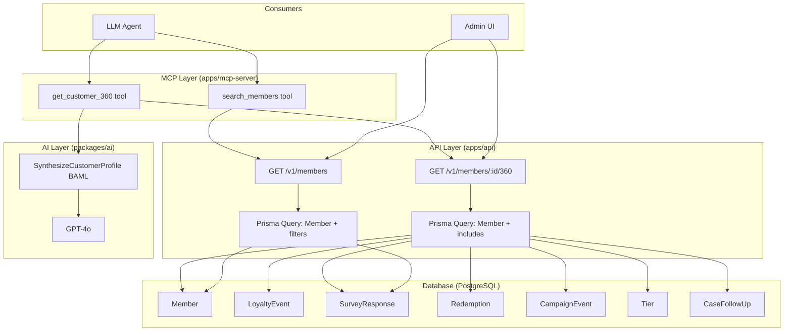

# Feature: CRM Core — Customer 360 API, Search, and KYC Synthesis

Issue: #98
Owner: Claude (AI Agent)

## Customer

**Primary:** Brand administrators and customer success managers using CustomerEQ to understand and serve their loyalty program members.

**Secondary:** LLM agents (via MCP tools) that need full customer context to provide intelligent support, generate reports, or power automated workflows.

## Customer's Desired Outcome

A brand admin can instantly see everything about a customer in one place — their profile, activity history, survey feedback, redemptions, campaign participation, tier status, and open support cases — without manually querying multiple screens or data sources. An LLM agent can retrieve this same 360-degree view in a single MCP tool call and receive a human-readable "Know Your Customer" narrative synthesized by AI.

Additionally, brand admins and LLM agents can search for customers using behavioral criteria ("show me at-risk promoters" = NPS >= 9 but recent sentiment < -0.3) rather than only looking up by ID.

## Customer Problem Being Solved

1. **Fragmented customer view:** The current `GET /v1/members/:id` endpoint returns only the flat member record. To understand a customer, you must make separate calls for events, surveys, redemptions, campaigns, and cases — then mentally synthesize the picture.

2. **No customer search:** Members can only be retrieved by exact ID. There is no way to find members by name, email, behavioral attributes (tier, sentiment, NPS score, points balance), or enrollment date range.

3. **No AI-powered customer narrative:** Even with all data assembled, there is no automated synthesis that explains engagement patterns, sentiment trajectory, risk signals, or recommended actions in natural language.

## User Experience That Will Solve the Problem

### UX Flow 1: Customer 360 API (S1)

1. Admin or LLM agent calls `GET /v1/members/:id/360` (or MCP tool `get_customer_360`).
2. API returns a single JSON response containing:
   - **Profile:** id, email, firstName, lastName, phone, pointsBalance, status, tier (name, rank, benefits), enrollmentDate, consent status
   - **Recent Activity:** Last 20 loyalty events (type, points, timestamp, payload summary)
   - **Survey Responses:** Last 10 survey responses (survey name, type, score, sentiment, topics, summary, completedAt)
   - **Redemptions:** Last 10 redemptions (reward name, pointsSpent, status, createdAt)
   - **Campaign Events:** Last 10 campaign events (campaign name, triggeredAt, status, result)
   - **Open Cases:** All open CaseFollowUp records (status, priority, assignee, slaDeadline, createdAt)
   - **Summary Stats:** totalEvents count, totalSurveyResponses count, averageSentiment, totalPointsEarned, totalPointsRedeemed
3. Response includes pagination metadata for sub-collections (`hasMore` flag per section).

### UX Flow 2: Customer Search (S3)

1. Admin or LLM agent calls `GET /v1/members` (or MCP tool `search_members`) with query parameters:
   - `q` — text search across name and email (ILIKE)
   - `tier` — filter by tier name or ID
   - `sentimentMin` / `sentimentMax` — filter by average survey sentiment
   - `npsMin` / `npsMax` — filter by most recent NPS score
   - `balanceMin` / `balanceMax` — filter by points balance
   - `status` — filter by member status (ACTIVE, INACTIVE, ERASED)
   - `enrolledAfter` / `enrolledBefore` — filter by enrollment date range
   - `limit` / `offset` — pagination (default limit: 20, max: 100)
   - `sortBy` — one of: `name`, `email`, `pointsBalance`, `createdAt`, `sentiment` (default: `createdAt`)
   - `sortOrder` — `asc` or `desc` (default: `desc`)
2. API returns paginated list of members with summary fields (id, email, name, points, tier, status, latestSentiment, latestNpsScore).
3. Response includes `total` count and pagination metadata.

### UX Flow 3: KYC Synthesis (S2)

1. LLM agent calls `get_customer_360` MCP tool to retrieve full customer data.
2. LLM agent (or API endpoint) passes 360 data to `SynthesizeCustomerProfile` BAML function.
3. BAML function returns structured KYC output:
   - `engagementLevel`: "high" | "medium" | "low" | "dormant" — based on event frequency and recency
   - `sentimentTrajectory`: "improving" | "stable" | "declining" — based on survey sentiment over time
   - `preferences`: string[] — inferred from purchase patterns, redemption choices, campaign participation
   - `riskSignals`: string[] — churn indicators (declining engagement, negative sentiment trend, SLA breaches)
   - `recommendedActions`: string[] — specific next-best-actions for this customer
   - `summary`: string — 2-3 sentence natural-language narrative of who this customer is

No UI mocks are required for this feature — it is entirely API/backend with MCP tool exposure. The consuming UI will be built in subsequent phases (Phase B: Health Score dashboard, Phase D: Support Widget).

### Design Standards

Generic UI baseline applied. No UI components introduced in this phase.

## Compliance Requirements

### GDPR (configured in fraim/config.json)

| Control | Requirement | Implementation |
|---------|-------------|----------------|
| C-GDPR-1 | Erased members SHALL have PII zeroed in responses | 360 and search endpoints check `Member.erased` flag; if true, return `[ERASED]` for email, firstName, lastName, phone |
| C-GDPR-2 | Soft-deleted members SHALL be excluded by default | All queries include `deletedAt: null` filter |
| C-GDPR-3 | Consent must be validated | 360 response includes `consentGivenAt` and `consentVersion` for audit; no data processing for members without consent |
| C-GDPR-4 | KYC synthesis SHALL not persist PII | BAML function output contains behavioral analysis only, no raw PII echoed back |

### CCPA (configured in fraim/config.json)

| Control | Requirement | Implementation |
|---------|-------------|----------------|
| C-CCPA-1 | Search results SHALL not expose PII of erased members | Same as C-GDPR-1 |
| C-CCPA-2 | Data access logging | 360 endpoint access logged via existing AuditEvent model |

*Note: Compliance requirements inferred from project context (`fraim/config.json` compliance settings: gdpr=true, ccpa=true) and project rules (#6 multi-tenant brandId, #13 GDPR/CCPA). Formal regulation URLs were not configured.*

## Requirements (SHALL-Style)

### Functional Requirements

| ID | Requirement | Acceptance Criteria |
|----|-------------|---------------------|
| R1 | `GET /v1/members/:id/360` SHALL return aggregated member profile with loyalty events, survey responses, redemptions, campaign events, tier details, and open cases | **Given** a valid member ID and brandId JWT, **When** the 360 endpoint is called, **Then** the response contains all six sub-collections with correct data |
| R2 | The 360 endpoint SHALL paginate sub-collections with configurable `limit` query parameters | **Given** a member with 50 loyalty events, **When** 360 is called with `eventsLimit=5`, **Then** only 5 events are returned with `hasMore: true` |
| R3 | `GET /v1/members` SHALL support text search across firstName, lastName, and email via `q` parameter | **Given** members "Alice Smith" and "Bob Alston", **When** search is called with `q=ali`, **Then** both members are returned |
| R4 | `GET /v1/members` SHALL support behavioral filters: tier, sentimentMin/Max, npsMin/Max, balanceMin/Max, status, enrolledAfter/Before | **Given** members with various NPS scores, **When** search is called with `npsMin=9&sentimentMax=-0.3`, **Then** only at-risk promoters are returned |
| R5 | `SynthesizeCustomerProfile` BAML function SHALL produce structured output with engagementLevel, sentimentTrajectory, preferences, riskSignals, recommendedActions, and summary | **Given** Customer 360 data for an active member with survey history, **When** the function is invoked, **Then** all six output fields are populated with contextually appropriate values |
| R6 | `get_customer_360` MCP tool SHALL be registered and call the 360 API endpoint | **Given** a valid memberId, **When** the MCP tool is invoked, **Then** it returns formatted 360 data |
| R7 | `search_members` MCP tool SHALL be registered and support all filter parameters | **Given** search criteria, **When** the MCP tool is invoked, **Then** it returns matching members |

### Data/State Constraints

| ID | Requirement | Acceptance Criteria |
|----|-------------|---------------------|
| R8 | All endpoints SHALL scope queries by `brandId` from JWT — never from request body | **Given** a JWT for brand A, **When** querying members, **Then** only brand A members are returned |
| R9 | All queries SHALL exclude soft-deleted records (`deletedAt IS NULL`) | **Given** a soft-deleted member, **When** 360 or search is called, **Then** deleted member is not found |
| R10 | Erased members (`erased=true`) SHALL have PII fields replaced with `[ERASED]` | **Given** an erased member, **When** 360 is called, **Then** email/name/phone show `[ERASED]` |
| R11 | Search by sentiment/NPS SHALL aggregate from `SurveyResponse` table via subquery or join | **Given** a member with survey responses, **When** filtering by sentiment, **Then** the filter uses actual survey data, not a cached field |

### Non-Functional Requirements

| ID | Requirement | Acceptance Criteria |
|----|-------------|---------------------|
| R12 | 360 endpoint response time SHALL be under 500ms for a member with up to 100 events, 50 surveys, 20 redemptions | **Given** a populated member, **When** 360 is called, **Then** response returns in < 500ms |
| R13 | Search endpoint SHALL support offset-based pagination with default limit 20, max 100 | **Given** 200 members matching criteria, **When** search is called without pagination params, **Then** first 20 are returned with total count |
| R14 | BAML KYC function SHALL use GPT-4o client for synthesis quality | **Given** the BAML function definition, **When** reviewing client assignment, **Then** it uses `GPT4o` client |

## Open Questions

1. **Health score inclusion:** Should the 360 response include a placeholder for a computed health score (to be implemented in Phase B), or should Phase B add it later?
2. **Full-text search strategy:** Should search use PostgreSQL `tsvector` for performance on large member sets, or is `ILIKE` sufficient for the mid-market customer base (typically < 100K members)?
3. **Sub-collection defaults:** Proposed defaults are 20 events, 10 surveys, 10 redemptions, 10 campaign events, all open cases. Are these appropriate?
4. **KYC caching:** Should `SynthesizeCustomerProfile` results be cached (e.g., in a `memberKyc` table with TTL), or always computed on-demand?

## Validation Plan

1. **API validation (Supertest integration tests):**
   - Call `GET /v1/members/:id/360` and verify all sub-collections are present and correctly populated
   - Call `GET /v1/members/:id/360` for a member with no events/surveys — verify empty arrays returned gracefully
   - Call `GET /v1/members/:id/360` for an erased member — verify PII is `[ERASED]`
   - Call `GET /v1/members/:id/360` for a non-existent member — verify 404
   - Call `GET /v1/members` with various filter combinations and verify correct results
   - Call `GET /v1/members?q=searchterm` and verify text search works
   - Verify pagination (limit, offset, total count) on search results
   - Verify brandId scoping — cannot access other brand's members

2. **MCP tool validation:**
   - Invoke `get_customer_360` via MCP and verify formatted output
   - Invoke `search_members` via MCP with filters and verify results

3. **BAML eval tests (packages/ai/src/evals/):**
   - Test `SynthesizeCustomerProfile` with a high-engagement member — verify positive engagement level and trajectory
   - Test with a declining member — verify risk signals are identified
   - Test with minimal data (new member, no events) — verify graceful handling
   - Test with an erased member's data — verify no PII leakage in output

4. **Compliance validation:**
   - Verify erased member PII masking in 360 and search responses
   - Verify soft-delete exclusion in all queries
   - Verify brandId scoping cannot be bypassed
   - Verify AuditEvent logging for 360 access

## Alternatives

| Alternative | Why Discard? |
|-------------|-------------|
| GraphQL API instead of REST | CustomerEQ is REST-only (Fastify); adding GraphQL increases complexity without clear benefit for this use case. The 360 endpoint achieves the same "fetch everything in one call" goal. |
| Client-side aggregation (multiple API calls) | Forces every consumer (admin UI, MCP tools, support widget) to re-implement aggregation logic. Server-side 360 is DRY and cacheable. |
| Materialized view for 360 data | Over-engineering for mid-market volumes. Prisma queries with `include` are sufficient. Can add materialized views later if performance demands. |
| Elasticsearch for member search | Overkill for < 100K members. PostgreSQL ILIKE with proper indexing is fast enough. Can migrate to ES later if needed. |
| Store KYC synthesis in a separate table | Adds staleness risk and cache invalidation complexity. On-demand synthesis is simpler for MVP. Can add caching in Phase B if latency is an issue. |

## Competitive Analysis

### Configured Competitors Analysis

*No competitors configured in `fraim/config.json`. Analysis based on web research and domain knowledge of CX-loyalty platforms (April 2026).*

| Competitor | Current Solution | Strengths | Weaknesses | Customer Feedback | Market Position |
|------------|------------------|-----------|------------|-------------------|-----------------|
| Annex Cloud (Loyalty Experience Platform) | Multi-product suite combining points, referrals, and UGC. API-first architecture with 125+ prebuilt integrations (Salesforce, SAP, Adobe, Oracle). CRM integration enriches profiles with loyalty data. | Deep loyalty data model; API-first; SAP Endorsed App status; enterprise-grade reliability; native CRM/CDP integration | No LLM-powered synthesis or AI narrative generation; no MCP/AI agent tool integration; behavioral search limited to pre-built segments rather than ad-hoc query parameters | "Good data but hard to get insights without exporting to BI tools" (inferred from review platforms) | Mid-market to enterprise loyalty leader; pricing not public |
| Salesforce (Einstein 1 + Loyalty Management) | Customer 360 via Data Cloud unifying all data sources. Einstein AI provides predictive scoring, generative email/ticket drafts, and Agentforce autonomous agents. | Massive data aggregation across all channels; Einstein AI embedded in CRM; Agentforce agents for 2026; predictive lead scoring | Extremely expensive ($300+/user/month for Sales Cloud + Loyalty add-on); requires Salesforce ecosystem buy-in; not purpose-built for loyalty CX signals; Customer 360 depends on Data Cloud configuration | "Powerful but requires significant integration work and Salesforce expertise" | Enterprise CRM leader; loyalty is an add-on module |
| Yotpo | E-commerce retention platform with Loyalty API for points/referrals. Customer records API returns balance and referral links. Modules: Reviews, Loyalty, SMS, UGC. | Strong e-commerce integration; Loyalty API with customer fetch endpoints; combined reviews + loyalty data; pricing starts ~$799/mo | API returns only points balance and referral link — no aggregated 360 view; no AI synthesis; no behavioral search; limited to D2C/retail vertical | "Great for reviews and retention but missing the enterprise loyalty connection" | E-commerce retention niche; strong in Shopify ecosystem |

### Additional Competitors Analysis

| Competitor | Current Solution | Strengths | Weaknesses | Customer Feedback | Market Position |
|------------|------------------|-----------|------------|-------------------|-----------------|
| Brierley/Capillary (Intelligent Loyalty Platform) | Suite of Loyalty+, Insights+, Engage+, CDP+, Rewards+. AI-driven behavioral segmentation. Data streaming + API + batch integration. | AI-driven segmentation and behavioral clustering; real-time personalized offers; comprehensive CDP integration; global enterprise scale | Primarily consulting-driven (not self-serve); no MCP/AI agent integration; no LLM-synthesized customer narratives; API documentation not publicly available | Positioned as premium consulting + technology; enterprise-focused pricing | Enterprise loyalty consulting + platform; acquired by Capillary Technologies |
| Open Loyalty | Headless, API-first loyalty platform with composable architecture. Rich building blocks via APIs and SDKs. | Developer-friendly; fully headless/composable; rich API surface; flexibility for custom 360 views | No built-in AI synthesis; no MCP tools; requires custom development for 360 aggregation; smaller ecosystem | "Flexible but requires development resources to build the full experience" | Developer-focused loyalty infrastructure |
| HubSpot CRM | Contact records with activity timeline, behavioral tracking, custom properties, robust search and filtering | Easy to use; excellent search and filtering; activity logging; large ecosystem | No loyalty-specific data model; no sentiment analysis from surveys; no MCP tools; no points/tier/redemption awareness | "Missing loyalty program awareness entirely" | Horizontal CRM leader (SMB/mid-market) |

### Competitive Positioning Strategy

#### Our Differentiation
- **MCP-native Customer 360:** CustomerEQ is the first CX-loyalty platform where AI agents can access full customer context via MCP tools (`get_customer_360`, `search_members`) in a single call. In 2026, as AI agent ecosystems grow via MCP and A2A protocols, this is a structural advantage. Competitors require manual dashboard navigation, custom API orchestration, or enterprise CDP configuration.
- **AI-synthesized KYC via BAML:** The `SynthesizeCustomerProfile` function produces actionable narrative (engagement level, sentiment trajectory, risk signals, recommended actions) — not just raw data aggregation. Salesforce Einstein offers generative AI but not purpose-built for loyalty CX synthesis. No other mid-market loyalty platform offers this.
- **Behavioral search with CX signals:** Search members by sentiment trajectory, NPS scores, and engagement patterns alongside traditional filters. Annex Cloud and Brierley offer pre-built segments; CustomerEQ offers ad-hoc behavioral queries accessible to both humans and AI agents.
- **Composable and affordable:** Unlike Salesforce ($300+/user/month) or Annex Cloud (enterprise pricing), CustomerEQ includes 360 + search + KYC in the platform subscription, targeting the underserved mid-market ($10M-$500M revenue).

#### Competitive Response Strategy
- **If Annex Cloud adds AI insights:** Our BAML architecture allows rapid iteration on synthesis quality with structured output guarantees; their monolithic platform will be slower to adapt. Our MCP integration gives AI agents direct access — a pattern Annex Cloud's architecture does not support.
- **If Salesforce adds MCP tools to Agentforce:** Our mid-market pricing and purpose-built loyalty+CX data model remain the differentiation. Salesforce's 360 requires Data Cloud configuration; ours is native.
- **If Open Loyalty adds AI features:** Our advantage is the integrated CX signal pipeline (surveys, sentiment, clusters, anomalies) that feeds 360 and KYC. Open Loyalty has loyalty primitives but no CX intelligence layer.

#### Market Positioning
- **Target Segment:** Mid-market companies ($10M-$500M) with active loyalty programs who want AI-powered customer intelligence without enterprise CRM complexity or Salesforce ecosystem lock-in.
- **Value Proposition:** Unified CX-loyalty intelligence accessible to both humans and AI agents, with automated KYC synthesis that turns scattered data into actionable customer narratives — included in the platform, not a separate analytics add-on.
- **Pricing Strategy:** Included in platform subscription. The 360 API, behavioral search, and KYC synthesis are core features, not upsell modules.

### Research Sources
- [Annex Cloud Loyalty Experience Platform — GetApp](https://www.getapp.com/customer-management-software/a/annex-cloud/) (April 2026)
- [Annex Cloud Capabilities Overview](https://www.annexcloud.com/capabilities-overview/) (April 2026)
- [Yotpo Loyalty API Reference — Fetch Customer Details](https://loyaltyapi.yotpo.com/reference/fetch-customer-details) (April 2026)
- [Yotpo E-Commerce Retention Marketing Platform](https://www.yotpo.com/) (April 2026)
- [Salesforce Einstein Customer 360: Unified Customer Profiles](https://www.itechcloudsolution.com/blogs/salesforce-einstein-customer-360/) (2026)
- [Salesforce Einstein AI Overview](https://www.salesforce.com/products/einstein/overview/) (April 2026)
- [Brierley Intelligent Loyalty Platform](https://www.brierley.com/intelligent-loyalty) (April 2026)
- [Open Loyalty — Top Loyalty Software Comparison](https://www.openloyalty.io/insider/best-loyalty-software-comparison-guide) (2026)
- [Customer 360 in 2026: The Definition Has Changed — Treasure Data](https://www.treasuredata.com/blog/customer-360) (2026)
- [APIs for AI Agents: The 5 Integration Patterns — Composio](https://composio.dev/content/apis-ai-agents-integration-patterns) (2026)
- CustomerEQ business validation report (`docs/business-development/business-validation-report-cx-loyalty-platform-2026-03-24.md`)
- Codebase brainstorming analysis (`docs/brainstorming/codebase-brainstorming-2026-04-03.md`)
- Research date: 2026-04-03

## Data Flow Diagram



## API Response Schemas

### GET /v1/members/:id/360

```json
{
  "member": {
    "id": "string",
    "email": "string",
    "firstName": "string | null",
    "lastName": "string | null",
    "phone": "string | null",
    "pointsBalance": 0,
    "status": "ACTIVE",
    "enrollmentDate": "2026-01-01T00:00:00Z",
    "consentGivenAt": "2026-01-01T00:00:00Z",
    "consentVersion": "1.0",
    "tier": {
      "id": "string",
      "name": "Gold",
      "rank": 2,
      "benefits": ["2x points", "Free shipping"],
      "multiplier": 2.0
    }
  },
  "recentEvents": {
    "items": [
      {
        "id": "string",
        "eventType": "purchase",
        "pointsEarned": 100,
        "payload": {},
        "createdAt": "2026-03-15T10:00:00Z"
      }
    ],
    "hasMore": true,
    "total": 45
  },
  "surveyResponses": {
    "items": [
      {
        "id": "string",
        "surveyName": "Q1 NPS",
        "surveyType": "NPS",
        "score": 9,
        "sentiment": 0.8,
        "topics": ["product quality", "fast shipping"],
        "summary": "Very satisfied with recent purchase experience",
        "completedAt": "2026-03-10T14:00:00Z"
      }
    ],
    "hasMore": false,
    "total": 3
  },
  "redemptions": {
    "items": [
      {
        "id": "string",
        "rewardName": "Free Coffee",
        "pointsSpent": 500,
        "status": "FULFILLED",
        "createdAt": "2026-02-20T09:00:00Z"
      }
    ],
    "hasMore": false,
    "total": 1
  },
  "campaignEvents": {
    "items": [
      {
        "id": "string",
        "campaignName": "NPS Recovery",
        "triggeredAt": "2026-03-01T12:00:00Z",
        "status": "executed",
        "result": { "points": 500 }
      }
    ],
    "hasMore": false,
    "total": 1
  },
  "openCases": [
    {
      "id": "string",
      "status": "OPEN",
      "priority": "HIGH",
      "assignee": "cs-team@example.com",
      "slaDeadline": "2026-04-05T12:00:00Z",
      "createdAt": "2026-04-01T08:00:00Z"
    }
  ],
  "stats": {
    "totalEvents": 45,
    "totalSurveyResponses": 3,
    "averageSentiment": 0.65,
    "totalPointsEarned": 2500,
    "totalPointsRedeemed": 500
  }
}
```

### GET /v1/members (Search)

```json
{
  "members": [
    {
      "id": "string",
      "email": "string",
      "firstName": "string | null",
      "lastName": "string | null",
      "pointsBalance": 0,
      "status": "ACTIVE",
      "tierName": "Gold | null",
      "latestSentiment": 0.8,
      "latestNpsScore": 9,
      "createdAt": "2026-01-01T00:00:00Z"
    }
  ],
  "total": 150,
  "limit": 20,
  "offset": 0
}
```

### SynthesizeCustomerProfile BAML Output

```json
{
  "engagementLevel": "high",
  "sentimentTrajectory": "improving",
  "preferences": ["premium products", "experiential rewards", "email communication"],
  "riskSignals": [],
  "recommendedActions": ["Offer tier upgrade preview", "Invite to VIP event"],
  "summary": "Alice is a highly engaged Gold-tier member with improving sentiment. She prefers premium products and experiential rewards. No churn risk detected. Consider tier upgrade or VIP event invitation to deepen loyalty."
}
```
