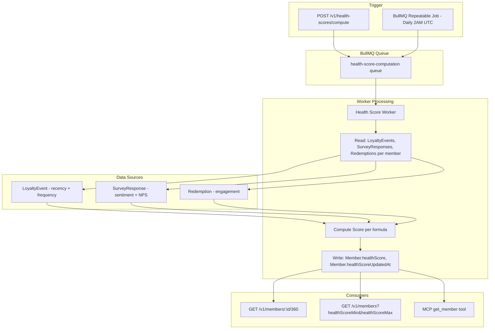

# Feature: Customer Health Score — Proactive Customer Management Metric

Issue: #99
Owner: Claude (feature-specification job)

## Customer

CX program managers and customer success teams at mid-market companies who need to proactively identify at-risk customers before they churn. Today they have survey data, loyalty events, and redemption records spread across different dashboards, but no single metric that tells them "this customer needs attention now."

## Customer's Desired Outcome

A single 0-100 health score per customer that combines behavioral signals (engagement recency and frequency), sentiment trajectory (survey feedback trends), NPS patterns, and loyalty program participation (redemption activity) into one actionable number. Managers can sort, filter, and prioritize their customer outreach based on this score.

## Customer Problem Being Solved

Today, determining which customers are at risk requires a CX manager to:
1. Check the loyalty dashboard for members with declining engagement
2. Cross-reference with survey responses to see who submitted negative feedback
3. Look at redemption history to spot disengaged members
4. Mentally combine these signals to decide who needs attention

This process is:
- **Time-consuming**: Requires checking 3-4 different views and mentally synthesizing data
- **Inconsistent**: Different team members weigh signals differently
- **Reactive**: By the time patterns are noticed manually, the customer may have already churned
- **Not scalable**: Works for 50 customers, fails at 5,000

The health score automates this synthesis, applying a consistent formula across all members and surfacing at-risk customers proactively.

## User Experience That Will Solve the Problem

### UX Flow

#### 1. Health Score Visible in Customer 360 View (`/admin/members/:id`)

When an admin views a member's Customer 360 profile, the health score is prominently displayed:

- **Health Score Badge**: Large circular indicator showing 0-100 score with color coding:
  - 80-100: Green ("Healthy") — active, positive sentiment, recent engagement
  - 60-79: Yellow ("Needs Attention") — declining engagement or mixed sentiment
  - 40-59: Orange ("At Risk") — low engagement or negative sentiment trend
  - 0-39: Red ("Critical") — disengaged, negative sentiment, no recent activity
- **Last Updated**: Timestamp showing when the score was last computed
- **Score Breakdown**: Expandable section showing the five component subscores:
  - Recency (last event date relative to now)
  - Frequency (event count in 90-day window)
  - Sentiment (average SurveyResponse.sentiment)
  - NPS Trend (trajectory: improving, stable, declining)
  - Engagement (redemption count and points usage)

#### 2. Member List with Health Score Filtering (`/admin/members`)

The admin member list gains health score capabilities:

- **Health Score Column**: New sortable column showing each member's score with color indicator
- **Filter Controls**: Range slider or min/max inputs for filtering by health score range
  - Presets: "Critical (<40)", "At Risk (<60)", "Healthy (80+)"
- **Sort**: Can sort members by health score ascending (worst first) for prioritization

#### 3. Batch Computation Controls (`/admin/settings` or admin API)

Admins can trigger or schedule health score computation:

- **On-Demand**: "Recalculate Health Scores" button triggers immediate batch computation
- **Scheduled**: Scores auto-compute on a configurable schedule (default: daily at 2 AM UTC)
- **Status**: Shows last run time, members processed, and next scheduled run

#### 4. MCP Tool Integration

The MCP `get_member` tool includes healthScore in its response, enabling LLM-powered workflows:
- "Show me all members with declining health scores"
- "Who are our most at-risk customers this week?"
- "What's driving the low health score for member X?"

**UI Mocks**: [99-health-score-360.html](mocks/99-health-score-360.html), [99-health-score-list.html](mocks/99-health-score-list.html)

**Design Standards Applied**: Generic UI baseline. Mocks use Tailwind CSS v4 utility classes and shadcn/ui-style components consistent with the existing admin portal patterns.

## Requirements

### Functional Requirements

| Tag | Requirement | Acceptance Criteria |
|-----|-------------|---------------------|
| R1 | The system SHALL add a `healthScore` field (Int, nullable, 0-100) to the Member model | Given a Member record, When the schema is migrated, Then the field exists with a default of null |
| R2 | The system SHALL add a `healthScoreUpdatedAt` field (DateTime, nullable) to the Member model | Given a Member record, When healthScore is computed, Then healthScoreUpdatedAt is set to the computation timestamp |
| R3 | The system SHALL compute health scores via a batch BullMQ job that processes all active members for a given brand | Given a brand with 100 active members, When the health-score-computation job runs, Then all 100 members receive updated healthScore values |
| R4 | The scoring formula SHALL combine five signals: (a) recency of last LoyaltyEvent, (b) frequency of LoyaltyEvents in 90-day window, (c) average SurveyResponse.sentiment, (d) NPS trend from SurveyResponse.score where survey type is NPS, (e) Redemption count in 90-day window | Given a member with known activity data, When health score is computed, Then the result reflects all five signal components |
| R5 | The scoring weights SHALL be configurable and not hardcoded | Given default weights summing to 1.0, When weights are overridden via environment variable or brand config, Then the formula uses the overridden weights |
| R6 | GET /v1/members/:id/360 SHALL include `healthScore` and `healthScoreUpdatedAt` in the response body | Given a member with a computed health score of 72, When the 360 endpoint is called, Then the response includes `healthScore: 72` and a valid `healthScoreUpdatedAt` timestamp |
| R7 | GET /v1/members SHALL support `healthScoreMin` and `healthScoreMax` query parameters for filtering | Given members with scores [20, 55, 78, 90], When queried with healthScoreMin=50&healthScoreMax=80, Then only members with scores 55 and 78 are returned |
| R8 | MCP `get_member` tool SHALL include `healthScore` and `healthScoreUpdatedAt` in its response | Given a member with healthScore=65, When get_member MCP tool is called, Then the response includes the health score data |
| R9 | New members with no interaction history SHALL receive a neutral score of 50 | Given a member enrolled today with zero LoyaltyEvents and zero SurveyResponses, When health score is computed, Then the score is 50 |
| R10 | Erased members (Member.erased=true) SHALL be excluded from batch computation | Given a member with erased=true, When the batch job runs, Then that member's healthScore is NOT updated |
| R11 | The batch job SHALL be triggerable on-demand via API endpoint and schedulable via cron/repeatable BullMQ job | Given an admin, When POST /v1/health-scores/compute is called, Then the batch job is enqueued immediately |

### Edge Cases

| Tag | Edge Case | Expected Behavior |
|-----|-----------|-------------------|
| E1 | Member has LoyaltyEvents but no SurveyResponses | Sentiment and NPS components use neutral defaults (0.0 sentiment, no NPS penalty); score weighted across available signals only |
| E2 | Member has zero activity of any kind | Score is 50 (neutral baseline) |
| E3 | Batch job triggered while another is already running | Second invocation is deduplicated (BullMQ job ID based on brandId prevents duplicates) |
| E4 | Member is soft-deleted (deletedAt is set) but not erased | Member is excluded from batch computation (only ACTIVE status members are computed) |
| E5 | Brand has 0 active members | Batch job completes successfully with 0 members processed |
| E6 | healthScore is null (never computed) | UI shows "Not yet computed" indicator; API returns null |

## Scoring Formula

### Component Weights (Default)

| Component | Weight | Signal Source | Scoring Logic |
|-----------|--------|---------------|---------------|
| Recency | 0.25 | `LoyaltyEvent.createdAt` (most recent) | Days since last event: 0-7 days = 100, 8-30 = 75, 31-60 = 50, 61-90 = 25, 90+ = 0 |
| Frequency | 0.20 | `LoyaltyEvent` count in 90-day window | Normalized: 10+ events = 100, linear scale below |
| Sentiment | 0.25 | `SurveyResponse.sentiment` average (last 90 days) | Maps -1.0..1.0 to 0..100 (linear: sentiment * 50 + 50) |
| NPS Trend | 0.15 | `SurveyResponse.score` where survey type is NPS | Last NPS: Promoter (9-10) = 100, Passive (7-8) = 60, Detractor (0-6) = 20; adjusted by trend direction |
| Engagement | 0.15 | `Redemption` count in 90-day window | 3+ redemptions = 100, 2 = 75, 1 = 50, 0 = 25 |

### Formula

```
healthScore = round(
  recencyScore * recencyWeight +
  frequencyScore * frequencyWeight +
  sentimentScore * sentimentWeight +
  npsTrendScore * npsTrendWeight +
  engagementScore * engagementWeight
)
```

Score is clamped to [0, 100] range. When a component has no data (e.g., no survey responses), that component's weight is redistributed proportionally across components that do have data.

### Weight Configuration

Default weights are defined in environment variable `HEALTH_SCORE_WEIGHTS` as JSON:

```json
{
  "recency": 0.25,
  "frequency": 0.20,
  "sentiment": 0.25,
  "npsTrend": 0.15,
  "engagement": 0.15
}
```

If not set, the defaults above are used. Weights must sum to 1.0.

## Compliance Requirements

Compliance requirements inferred from project context (`fraim/config.json`: GDPR=true, CCPA=true, SOC2=target-month-12).

| Requirement | Regulation | Control |
|-------------|-----------|---------|
| CR1: When a member is erased (GDPR Article 17 right to erasure), healthScore and healthScoreUpdatedAt SHALL be set to null | GDPR | Erasure job in `apps/worker` must include healthScore fields in zeroing logic |
| CR2: healthScore is derived data (not directly provided PII) but SHALL be included in CCPA data export/access requests | CCPA | Data export endpoint must include healthScore |
| CR3: Batch job SHALL be brand-scoped (brandId on every query) — never cross-tenant | Multi-tenant | Prisma middleware enforces brandId scoping per project rule #6 |
| CR4: healthScore computation SHALL NOT process members with consentGivenAt=null | GDPR | Batch job WHERE clause includes consentGivenAt IS NOT NULL |
| CR5: All health score computation events SHALL be logged for audit trail | SOC2 (future) | AuditEvent record created per batch run with metadata showing members processed, timestamp, formula version |

## Data Flow



## Validation Plan

### API Validation
1. Run migration, verify `healthScore` and `healthScoreUpdatedAt` columns exist on Member table
2. POST /v1/health-scores/compute for a brand with known members
3. GET /v1/members/:id/360 and verify healthScore is present and in [0, 100]
4. GET /v1/members?healthScoreMin=0&healthScoreMax=50 and verify filtering works
5. Verify erased members are excluded (member with erased=true still has null healthScore after batch run)

### Unit Test Validation
1. Scoring formula unit tests with known inputs produce expected outputs
2. Weight redistribution when components have no data
3. Edge cases: new member (score=50), member with only events (no surveys), fully active member
4. Configuration parsing for custom weights

### Integration Test Validation
1. Full batch job execution against test database with seeded members
2. BullMQ inline mode processes correctly (QUEUE_MODE=inline)
3. Concurrent job deduplication (two simultaneous triggers produce one run)

### Compliance Validation
1. Trigger erasure for a member, verify healthScore is set to null
2. Verify batch job query includes brandId filter (no cross-tenant leakage)
3. Verify members without consent are excluded from computation

### Browser Validation
1. Navigate to /admin/members/:id — health score badge displays with correct color
2. Navigate to /admin/members — health score column visible, sorting works
3. Filter by health score range and verify results match

## Alternatives

| Alternative | Why Discard? |
|-------------|-------------|
| Real-time score computation on every event | Adds latency to the event pipeline; violates the <15ms event processing SLA. Batch is simpler and decoupled. |
| Store score in Redis cache only (not in DB) | Loses score on cache eviction; cannot filter/sort in SQL queries. Need it persisted on the Member row. |
| LLM-computed health score (GPT-4o per member) | Cost-prohibitive at scale (10K members x $0.01/call = $100/day). Deterministic formula is cheaper and more predictable. |
| Per-survey-response delta update (incremental) | Complex state management, race conditions with concurrent events. Batch recomputation is simpler and idempotent. Can add incremental as future optimization. |
| Store health score in a separate HealthScore table | Adds join overhead for every member query. A denormalized field on Member is simpler and matches existing patterns (pointsBalance is on Member, not a separate table). |

## Competitive Analysis

### Configured Competitors Analysis

No competitors configured in `fraim/config.json`. Analysis based on web research and domain knowledge.

### Additional Competitors Analysis

| Competitor | Current Solution | Strengths | Weaknesses | Customer Feedback | Market Position |
|------------|------------------|-----------|------------|-------------------|-----------------|
| **Gainsight** | Scorecards with configurable Measures, Measure Groups, and grading schemes (color/letter/number). Admin configures from Administration > Scorecard. Supports manual and Rules-Engine-automated scoring. Paid "Insight Agent" add-on automates scoring with AI. | Highly configurable multi-dimensional scorecards; deep Salesforce integration; Horizon Analytics for reporting; Adoption Explorer for product usage; Journey Orchestrator for automated journeys | Enterprise pricing ($50K+/year); requires weeks of admin setup; Insight Agent is a paid add-on requiring clean data pipelines; no native loyalty program integration | "Powerful but takes 3 months to configure properly" (Pulse Library community) | Market leader in enterprise customer success |
| **Totango** | Two scoring modes: Account Health (single red/yellow/green) and Multidimensional Health (multiple dimensions tracked separately). SuccessBLOCs provide pre-built templates including "Analyze Your Customer Health" module with preloaded tasks, campaigns, and SuccessPlays. | Quick setup via SuccessBLOC templates; good mid-market fit; preloaded best-practice workflows; dimensional trend analysis; built-in Segments and Reports | No native loyalty program; no points/redemption signals; limited survey integration (NPS only via separate module); less configurable than Gainsight | "Easy to start but hard to customize deeply" (G2 reviews 2026) | Strong mid-market customer success presence |
| **ChurnZero** | ChurnScores measure account health using customer-chosen metrics. Real-time scoring from product usage, CRM, billing, support, surveys, and engagement data. Segment-based scoring (SMB vs enterprise, region, industry). | Real-time updates (not batch); connects usage + CRM + billing + support in single view; segment-tailored scoring; improved reporting in 2026 | No native loyalty program; primarily SaaS-focused (usage tracking); survey data requires third-party integration; no sentiment analysis | "Improved health score customization makes it easier to identify risks" (Gartner Peer Insights 2026) | Growing in B2B SaaS vertical |
| **Annex Cloud** | RFM (Recency, Frequency, Monetary) dashboard for segmentation. Identifies Champions, at-risk, and hibernating customers. RFM + LTV + demographics + social graph + engagement statistics in segmentation dashboard. | Native loyalty platform with deep earn/burn features; RFM dashboard built-in; advanced segmentation with targeted campaign delivery; enterprise loyalty expertise | RFM only (no sentiment analysis, no NPS integration, no AI-powered scoring); segmentation is manual/rule-based, not computed health score; no unified CX signal integration | "Good for loyalty basics" (SoftwareAdvice 2026) | Established enterprise loyalty vendor |

### Competitive Positioning Strategy

#### Our Differentiation
- **Unified CX + Loyalty Signals**: The only solution combining NPS/CSAT/CES sentiment with loyalty engagement data (points, redemptions, tier, campaign participation) in a single computed health score. Gainsight and ChurnZero lack loyalty signals; Annex Cloud lacks CX sentiment signals. This is uniquely possible because CustomerEQ owns both the survey pipeline and the loyalty engine.
- **Zero Additional Cost or Infrastructure**: Score computation runs inside the existing BullMQ event processing infrastructure. Competitors require separate customer success tools ($50K+/year for Gainsight) or manual RFM configuration (Annex Cloud). No additional product to buy, no data pipeline to build.
- **Transparent, Configurable Formula**: Documented weights with per-component breakdown visible to admins in the UI. Gainsight requires weeks of admin setup; Totango uses opaque SuccessBLOC templates; ChurnZero mixes qualitative and quantitative inputs without clear weighting visibility.
- **Batch + Future Real-Time Path**: Starting with idempotent batch computation (simple, debuggable) with a clear path to event-triggered incremental updates. ChurnZero offers real-time but at the cost of complexity; our approach starts simple and can evolve.
- **AI-Powered Sentiment Component**: Health score incorporates AI-analyzed sentiment from open-ended survey feedback (via BAML/GPT-4o pipeline already in production). No competitor in the loyalty space has this.

#### Competitive Response Strategy
- **If Gainsight adds loyalty integration**: Emphasize our real-time CX-to-action loop (15-min feedback-to-loyalty-action SLA) vs their batch analytics approach, and our all-in-one pricing vs their add-on model
- **If Annex Cloud adds AI health scoring**: Emphasize our proven BAML sentiment pipeline and multi-signal synthesis vs their RFM-only foundation
- **If ChurnZero targets retail/loyalty**: Emphasize our native points/redemption/tier signals that ChurnZero would need to integrate from external systems

#### Market Positioning
- **Target Segment**: Mid-market companies ($10M-$500M revenue) who run both CX surveys and loyalty programs but use separate tools today. Mid-market loyalty platform pricing ranges $200-$1,000/month; adding a separate customer success tool (Gainsight/Totango) doubles that cost.
- **Value Proposition**: One platform that turns customer feedback into loyalty actions AND computes customer health from both CX and loyalty signal types — no integration tax.
- **Pricing Strategy**: Health score included in platform subscription (no per-seat customer success tool fee, no paid add-on for AI scoring)

### Research Sources
- [Gainsight Scorecards Overview](https://support.gainsight.com/gainsight_nxt/05Scorecards/01About/Scorecards_Overview) — Scorecard configuration and measures documentation
- [Gainsight Features 2026 Guide](https://www.oliv.ai/blog/gainsight-features) — Feature overview including hidden costs and Insight Agent add-on
- [Totango Customer Health Console](https://support.totango.com/hc/en-us/articles/203657305-Customer-Health-Console) — Account Health and Multidimensional Health modes
- [Totango SuccessBLOCs](https://support.totango.com/hc/en-us/articles/360015782672-Understand-SuccessBLOCs) — Template-based health scoring modules
- [ChurnZero Health Score Dashboard](https://churnzero.com/features/customer-health-scores/) — ChurnScores and real-time scoring features
- [ChurnZero Health Score Handbook](https://churnzero.com/guides/the-customer-health-score-handbook/) — Scoring methodology and best practices
- [Annex Cloud RFM Segmentation](https://www.annexcloud.com/blog/revolutionising-segmentation-individualisation-using-rfm-to-step-further/) — RFM analysis and segmentation dashboard
- [Annex Cloud Advanced Segmentation](https://www.annexcloud.com/advanced-segmentation/) — Segmentation capabilities overview
- [Mid-Market Loyalty Platform Comparison 2026](https://www.openloyalty.io/insider/best-loyalty-software-comparison-guide) — Pricing and feature comparison
- Research date: 2026-04-03

## Open Questions

1. **Phase A Dependency**: The Customer 360 endpoint (GET /v1/members/:id/360) does not exist yet. This spec assumes Phase A will create it and this feature adds healthScore to its response. If Phase A is delayed, the healthScore field can still be added to the existing GET /v1/members/:id response.
2. **Per-Brand Weight Configuration**: Should weights be stored in a Brand-level database field (allowing per-brand customization via admin UI) or only via environment variables (global for all brands)? This spec assumes environment-level defaults with a future path to per-brand overrides.
3. **Incremental Updates**: Should individual events (new survey response, new loyalty event) trigger a single-member score recomputation? This spec starts with batch-only; incremental updates can be added as a future optimization once the batch formula is proven.
