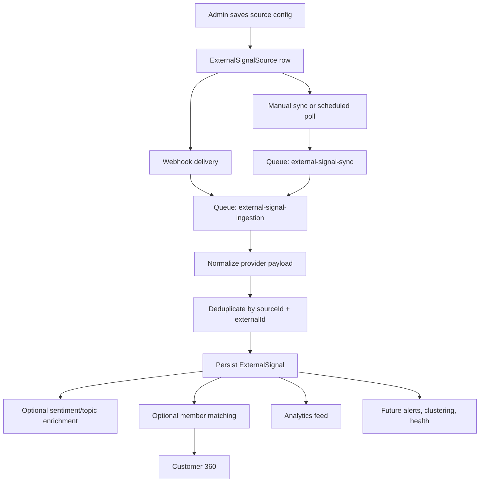

# Technical Design: Social Review Ingestion and External Signal Hub

Issue: #113  
Owner: Codex (technical-design job)  
Spec: `docs/feature-specs/113-social-review-ingestion.md`

## Customer

Brand admins, CX operators, and growth teams who already use CustomerEQ for first-party feedback, loyalty, and Customer 360, but still have external voice trapped in review platforms and social tools.

## Customer Problem Being Solved

1. External customer voice is fragmented across Google reviews, owned LinkedIn activity, Reddit threads, X posts, and partner-managed feeds.
2. The current Integrations page is a static webhook URL display, not a real registry of source configurations.
3. The current CX analytics stack only understands `SurveyResponse` as typed CX input.
4. The current Customer 360 endpoint does not expose matched external review or social signals.
5. The current webhook pattern works for authenticated inbound CX events, but there is no normalized source model for public or third-party signals.

## User Experience That Will Solve the Problem

### UX Flow 1: Configure a Source in Integrations

1. Admin opens `/admin/integrations`.
2. Admin sees existing CRM/webhook integrations plus a new `Review and Social Sources` registry.
3. Admin adds a source with:
   - source type
   - connection method
   - sync mode
   - scope definition
   - filtering rules
   - matching policy
4. Admin tests the source, sees sample items, then activates it.
5. Admin can later inspect health, last sync, records imported, and last error.

### UX Flow 2: Review External Signals in CX Analytics

1. Operator opens `/admin/analytics/cx`.
2. Operator filters by signal origin: survey, review, social, or all.
3. External signals appear in the same response feed shape as survey-derived records where possible, with source provenance and canonical links.
4. Unmatched content remains visible at brand scope without incorrectly mutating a member profile.

### UX Flow 3: View Matched External Signals in Customer 360

1. Operator opens `/admin/members/:id`.
2. The page calls `GET /v1/members/:id/360`.
3. The response now includes an `externalSignals` collection.
4. The UI renders matched reviews/posts/comments with rating, sentiment, topics, provenance, and original URL.

## Technical Details

### 1. Delivery Scope and Architecture Choice

This feature should be implemented as a normalized source-registry plus signal-ingestion platform, not as a set of one-off connectors.

The first implementation should ship:

- A brand-scoped source registry for external signal sources.
- A normalized `ExternalSignal` store.
- A queue-first ingestion pipeline for webhook and poll-based providers.
- Customer 360 exposure for matched signals.
- CX analytics exposure for unmatched and matched signals.
- One production-grade native connector path for Google Business Profile.
- A generic webhook/API connector that can represent X, Reddit, LinkedIn, or partner-managed ingestion even where provider-specific implementation is staged.

Non-goals for this issue:

- Direct operator reply workflows.
- Full social-care inbox behavior.
- A new first-class product catalog model.
- Broad scraping-based listening.

### 2. Repo-Native Implementation Shape

The design extends existing repo patterns rather than introducing a parallel subsystem:

- `apps/api/src/routes/webhooks.ts` already handles verified inbound payloads and normalization.
- `apps/api/src/queues/bullmq.ts` already routes asynchronous work through BullMQ or inline mode.
- `apps/api/src/routes/analytics.ts` already owns CX feed and response endpoints.
- `apps/api/src/routes/members.ts` already owns Customer 360.
- `apps/web/src/app/(admin)/admin/integrations/page.tsx` already owns the admin integrations surface.
- `apps/web/src/app/(admin)/admin/analytics/cx/page.tsx` already renders the CX workspace.
- `apps/web/src/app/(admin)/admin/members/[id]/page.tsx` already renders Customer 360.

The implementation should add a new route module for external-signal source management rather than expanding `public.ts`, because these endpoints are authenticated admin operations and not public utilities.

### 3. Prisma Schema Changes

**File**: `packages/database/prisma/schema.prisma`

Add four enums:

```prisma
enum ExternalSourceType {
  GOOGLE_BUSINESS_PROFILE
  LINKEDIN_ORG
  REDDIT
  X
  GENERIC_WEBHOOK
  GENERIC_API
}

enum ExternalSyncMode {
  WEBHOOK
  POLL
  MANUAL
}

enum ExternalSignalStatus {
  ACTIVE
  HIDDEN
  DELETED
}

enum ExternalMatchStatus {
  UNMATCHED
  CANDIDATE
  MATCHED
  REJECTED
}
```

Add two new models:

```prisma
model ExternalSignalSource {
  id                   String           @id @default(cuid())
  brandId              String
  brand                Brand            @relation(fields: [brandId], references: [id])
  name                 String
  sourceType           ExternalSourceType
  connectionMethod     String
  syncMode             ExternalSyncMode
  enabled              Boolean          @default(false)
  scopeConfig          Json
  filterConfig         Json?
  matchingConfig       Json?
  credentialRef        String?
  healthStatus         String           @default("never_synced")
  lastCursor           Json?
  lastSyncAt           DateTime?
  lastSuccessAt        DateTime?
  lastImportCount      Int?
  lastError            String?
  lastErrorAt          DateTime?
  createdAt            DateTime         @default(now())
  updatedAt            DateTime         @updatedAt

  signals              ExternalSignal[]

  @@index([brandId, enabled])
  @@index([brandId, sourceType])
  @@map("external_signal_sources")
}

model ExternalSignal {
  id                   String              @id @default(cuid())
  brandId              String
  brand                Brand               @relation(fields: [brandId], references: [id])
  sourceId             String
  source               ExternalSignalSource @relation(fields: [sourceId], references: [id])
  memberId             String?
  member               Member?             @relation(fields: [memberId], references: [id])
  sourceType           ExternalSourceType
  externalId           String
  status               ExternalSignalStatus @default(ACTIVE)
  matchStatus          ExternalMatchStatus @default(UNMATCHED)
  matchConfidence      Float?
  matchMethod          String?
  body                 String
  summary              String?
  rating               Float?
  sentiment            Float?
  confidence           Float?
  topics               String[]
  canonicalUrl         String?
  externalAuthorHandle String?
  externalAuthorLabel  String?
  subjectType          String?
  subjectKey           String?
  subjectLabel         String?
  providerStatus       String?
  statusHistory        Json              @default("[]")
  providerMetadata     Json?
  rawPayload           Json
  postedAt             DateTime?
  ingestedAt           DateTime           @default(now())
  updatedAt            DateTime           @updatedAt

  @@unique([sourceId, externalId])
  @@index([brandId, postedAt])
  @@index([brandId, matchStatus, postedAt])
  @@index([brandId, memberId, postedAt])
  @@map("external_signals")
}
```

Also extend existing relations:

- `Brand.externalSignalSources ExternalSignalSource[]`
- `Brand.externalSignals ExternalSignal[]`
- `Member.externalSignals ExternalSignal[]`

#### 3.1 Why This Model

This model solves the actual gaps without over-modeling:

- `ExternalSignalSource` is the admin-configured registry entry.
- `ExternalSignal` is the normalized operational record.
- Provider credentials are not stored inline in cleartext JSON. The table stores `credentialRef` and masked metadata only.
- `subjectType` and `subjectKey` let us associate signals to a brand sub-scope such as product, location, keyword group, or campaign without blocking on a new product domain model.

#### 3.2 Migration Impact

This is an additive migration only. No existing tables need destructive changes.

### 4. Shared Schema and Type Changes

Add a new shared schema module:

- `packages/shared/src/zod/externalSignal.schema.ts`

Export:

- `CreateExternalSignalSourceSchema`
- `UpdateExternalSignalSourceSchema`
- `TestExternalSignalSourceSchema`
- `ExternalSignalSourceListQuerySchema`
- `ExternalSignalsQuerySchema`
- `Customer360ExternalSignalSchema`

Update:

- `packages/shared/src/zod/member.schema.ts`

Changes:

- Add `externalSignalsLimit` to `Customer360QuerySchema`.
- Extend `Customer360Response` with:

```ts
externalSignals: {
  items: Array<{
    id: string
    sourceId: string
    sourceType: string
    sourceName: string
    body: string
    summary: string | null
    rating: number | null
    sentiment: number | null
    topics: string[]
    canonicalUrl: string | null
    externalAuthorLabel: string | null
    subjectLabel: string | null
    postedAt: string | Date | null
    matchConfidence: number | null
  }>
  hasMore: boolean
  total: number
}
```

### 5. API Changes

#### 5.1 New Admin Source Registry Routes

**New file**: `apps/api/src/routes/externalSignals.ts`

Add authenticated admin routes:

- `GET /v1/admin/external-signal-sources`
- `POST /v1/admin/external-signal-sources`
- `PATCH /v1/admin/external-signal-sources/:id`
- `POST /v1/admin/external-signal-sources/:id/test`
- `POST /v1/admin/external-signal-sources/:id/sync`
- `GET /v1/admin/external-signals`

Notes:

- These routes are brand-scoped via existing auth and multi-tenant plugins.
- List endpoints follow the standard pagination envelope already defined in the architecture doc: `{ data, total, page, pageSize, totalPages }`.
- `test` should validate credentials or sample fetch without enabling the source.
- `test` returns sample normalized records for preview when the provider supports previewable fetches.
- `sync` enqueues a targeted source-sync job rather than polling inline.
- `GET /v1/admin/external-signals` provides a normalized feed for the analytics UI without overloading survey-specific query endpoints.
- The external-signal list supports filtering by source type, channel, subject, rating, sentiment, match status, and resolved identity state to match the UX in the functional spec.

#### 5.2 New Public Webhook Receiver for Generic Sources

**File**: `apps/api/src/routes/webhooks.ts`

Add:

- `POST /v1/integrations/webhooks/external-signals/:sourceId`

Behavior:

- Look up `ExternalSignalSource` by `sourceId` and `brandId`.
- Verify shared secret or provider signature based on source config.
- Persist raw inbound delivery as a queue payload, not a fully processed signal.
- Enqueue normalization into `EXTERNAL_SIGNAL_INGESTION`.

This keeps `webhooks.ts` as the canonical inbound integration surface and preserves the current repo’s webhook pattern.

#### 5.3 Customer 360 Route Extension

**File**: `apps/api/src/routes/members.ts`

Extend `GET /v1/members/:id/360`:

- Parse `externalSignalsLimit`.
- Query `ExternalSignal` where `memberId = member.id`, `brandId = request.brandId`, `matchStatus = MATCHED`, `status = ACTIVE`.
- Return a new `externalSignals` block alongside events, surveys, redemptions, campaigns, and cases.

Important rule:

- Only matched signals appear in member 360.
- Unmatched public content never appears on a member record.

#### 5.4 CX Analytics Route Extension

**File**: `apps/api/src/routes/analytics.ts`

Add:

- `GET /v1/analytics/cx/external-signals`

And expand:

- `GET /v1/analytics/cx`

Changes:

- Include aggregate counts for external signals by source type and sentiment distribution.
- Keep survey metrics intact.
- Do not force external records into `SurveyResponse`.
- Let the frontend combine survey-response detail and external-signal detail under one operator workspace.

This is cleaner than mutating `survey_responses` semantics or faking external items as surveys.

#### 5.5 App Registration

**File**: `apps/api/src/app.ts`

Register the new external-signal route module under `/v1`.

### 6. Queue and Worker Changes

#### 6.1 Shared Queue Names

**File**: `packages/shared/src/queues.ts`

Add:

```ts
EXTERNAL_SIGNAL_SYNC: 'external-signal-sync',
EXTERNAL_SIGNAL_INGESTION: 'external-signal-ingestion',
```

#### 6.2 API Producers

**File**: `apps/api/src/queues/bullmq.ts`

Add producers:

- `enqueueExternalSignalSync`
- `enqueueExternalSignalIngestion`

Inline mode should mirror worker behavior for local development and tests, just like the existing queue subsystem.

#### 6.3 Worker Processors

**Files**:

- `apps/worker/src/processors/externalSignalSync.ts`
- `apps/worker/src/processors/externalSignalIngestion.ts`
- `apps/worker/src/index.ts`

Responsibilities:

- `externalSignalSync`: poll provider or managed adapter for source-scoped records and enqueue normalized payload work.
- `externalSignalIngestion`: normalize provider payload, dedupe, persist `ExternalSignal`, enqueue downstream enrichment.
- On re-ingest of an existing provider record, append any provider-visible lifecycle transition such as edited, hidden, or deleted into `statusHistory` while updating the current `providerStatus`.

#### 6.4 Processing Pipeline



### 7. Connector Strategy by Provider

#### 7.1 Google Business Profile

Implementation mode:

- Native connector.
- OAuth credential reference.
- Polling plus near-real-time notifications where Business Profile notification support is available to the tenant setup.

Stored scope examples:

- location IDs
- account/location group IDs

#### 7.2 LinkedIn

Implementation mode:

- Owned company-page connector only.
- No claim of general LinkedIn web listening.
- Use organization-scoped activity/comments that are explicitly supported for owned surfaces.

Stored scope examples:

- organization URN
- post URNs
- owned-page notification subscription metadata

#### 7.3 Reddit

Implementation mode:

- OAuth-backed scheduled polling.
- Scope by subreddit and keyword rules.
- No scraping requirement.

Stored scope examples:

- subreddit list
- keyword rules
- author exclusions

#### 7.4 X

Implementation mode:

- Public mention coverage through search/filtered-stream style ingestion where tenant credentials support it.
- Owned-account activity can also be represented through webhook or account activity style events.
- Where direct native credentials are not available, the generic webhook/API connector remains the supported fallback.

Stored scope examples:

- search query
- account handle
- webhook source mapping

### 8. Matching and Identity Resolution

Matching must remain conservative.

Rules:

- If the provider payload contains a deterministic customer identifier already known to CustomerEQ, attach directly.
- If the signal can only be weakly inferred from display name or handle, keep it unmatched.
- Matching config is per source and can be disabled.
- `matchConfidence` and `matchMethod` are stored for auditability.
- A manual override path can be added later, but is not required for this issue.

Recommended match methods:

- `email_exact`
- `crm_contact_id`
- `loyalty_member_external_ref`
- `manual_override`

Explicit non-goal:

- Fuzzy auto-merge from public handles to member identity.

### 9. Security, Secrets, and Compliance

#### 9.1 Secrets

Provider tokens, webhook signing secrets, and OAuth refresh tokens should not live in the plain `scopeConfig` JSON.

Design rule:

- Store masked connection metadata in `ExternalSignalSource`.
- Store a `credentialRef` that resolves to secret material through the existing runtime secret-injection path backed by Azure Key Vault.

#### 9.2 Tenant Isolation

Every source, sync, signal, query, and match operation is brand-scoped.

#### 9.3 Data Minimization

Store:

- canonical URL
- author handle or redacted label
- review/post body
- rating if provided
- provider-native identifiers
- raw payload for audit/debug

Do not design around profile scraping, follower graphs, or non-essential external profile attributes.

#### 9.4 Erasure and Member Unlink

If a member is erased:

- keep the `ExternalSignal` record for brand analytics and audit
- null or redact member-linking fields
- keep the provider-native provenance and content subject to final legal policy

### 10. UI Changes

#### 10.1 Integrations

**File**: `apps/web/src/app/(admin)/admin/integrations/page.tsx`

Replace the static webhook-only layout with:

- existing webhook cards retained
- `Review and Social Sources` section
- source table with health badges
- add/edit drawer or modal
- test-connection action
- sync-now action

Use the existing admin visual language:

- neutral cards
- dense operator tables
- status badges
- restrained accent color

#### 10.2 CX Analytics

**File**: `apps/web/src/app/(admin)/admin/analytics/cx/page.tsx`

Add:

- source-type filters
- external signal counts
- external signal detail table
- provenance badges and canonical links

Keep survey analytics intact rather than collapsing the whole page into one feed component.

#### 10.3 Customer 360

**File**: `apps/web/src/app/(admin)/admin/members/[id]/page.tsx`

Add:

- `External Signals` card/list
- source badge
- rating if present
- sentiment/topics
- posted timestamp
- original-link CTA

### 11. Failure Modes and Timeouts

- Invalid credentials: source remains degraded; no records imported; actionable error stored on source.
- Successful syncs update `lastSuccessAt` and `lastImportCount` so the integrations UI can show the most recent successful import volume.
- Provider quota/rate limit: sync backs off, records error, keeps source enabled unless repeated failures exceed threshold.
- Duplicate deliveries: unique constraint on `[sourceId, externalId]` prevents duplication.
- Missing rating field: persist with `rating = null`.
- Provider deletes or edits original content: update `providerStatus`, append a `statusHistory` entry, and do not hard-delete automatically.
- Queue failure: retain cursor and source health state so retries are safe.
- Poll timeout: worker marks source run as failed after a bounded timeout and records provider-specific diagnostics.

Recommended timeout defaults:

- test connection: 10s
- webhook normalization job: 30s
- source poll job: 60s

### 12. Observability and Analytics

Logs:

- `external_source.created`
- `external_source.tested`
- `external_source.sync_started`
- `external_source.sync_succeeded`
- `external_source.sync_failed`
- `external_signal.ingested`
- `external_signal.deduplicated`
- `external_signal.match_skipped`
- `external_signal.matched`

Metrics:

- signals ingested by source type
- sync latency by source
- sync failure count by source
- unmatched vs matched ratio
- average time from post creation to ingestion

Alerts:

- repeated sync failures
- no successful sync for active source in defined window
- ingestion queue backlog above threshold

## Confidence Level

84/100

Reasoning:

- The internal extension points are strong and already proven: webhook normalization, queue-first processing, admin routes, analytics, and Customer 360 all exist.
- The main risk is provider variability, but the design keeps that risk at the connector edge rather than in the shared data model.
- No destructive data migration is required.

## Validation Plan

| User Scenario | Expected outcome | Validation method |
|---|---|---|
| Admin creates a Google review source | Source row saved with brand scope, config, health state | API integration test |
| Admin tests a source before enabling | Preview result or actionable error returned without activation | API integration test |
| Generic webhook source receives a payload twice | One normalized signal row persists due to dedupe | API integration test |
| X or Reddit source sync polls provider successfully | Signals stored under the correct brand and source | Worker integration test |
| Unmatched signal is ingested | Visible in CX analytics, absent from Customer 360 | API integration test |
| Deterministically matched signal is ingested | Appears in member 360 `externalSignals` block | API integration test |
| Active source starts failing auth | Integrations page shows degraded health and last error | Browser validation + API integration test |
| Analytics page filters external signals by source type | Operator sees narrowed result set with provenance badges | Browser validation |

## Test Matrix

### Unit

- `apps/api/src/routes/webhooks.test.ts`
  Add generic external-signal webhook signature and payload normalization tests.
- `packages/shared/src/zod/externalSignal.schema.test.ts`
  Validate source config schemas, matching config, and query parsing.
- `apps/worker/src/processors/externalSignalIngestion.test.ts`
  Validate normalization, dedupe, and conservative member matching.

### Integration

- `apps/api/test/integration/external-signals.test.ts`
  Cover source CRUD, test connection, sync enqueue, webhook ingestion, and member 360 enrichment.
- `apps/api/test/integration/analytics-external-signals.test.ts`
  Cover CX analytics exposure for matched and unmatched signals.
- Extend `apps/api/test/integration/members.test.ts`
  Cover `GET /v1/members/:id/360` external-signal block.

### E2E

- Extend `apps/web/test/e2e/workflows.spec.ts`
  One happy-path admin workflow:
  create source -> trigger sample ingest -> verify integration health -> open Customer 360 and see matched signal.

## Risks & Mitigations

| Risk | Severity | Mitigation |
|---|---|---|
| Provider capability drift or access-tier restrictions | Medium | Keep provider logic behind adapter interfaces; support generic webhook/API fallback; document exact supported scope per provider |
| Over-eager member matching attaches public content to the wrong member | High | Conservative deterministic-only matching in v1; unmatched by default |
| Integrations page becomes an overloaded settings surface | Medium | Keep CRM webhook cards and external-signal registry as separate sections with shared styling |
| External payloads are large or noisy | Medium | Persist raw payload, but normalize only the minimal operational shape needed for analytics and 360 |
| Polling providers exceed rate limits | Medium | Cursor-based sync, bounded polling windows, backoff, health-state surfacing |
| Product/location association becomes inconsistent because there is no first-class product model | Medium | Use explicit `subjectType` and `subjectKey` instead of inventing a premature product table |

## Observability (logs, metrics, alerts)

Minimum bar for implementation:

- source-level success/failure counters
- queue backlog visibility for sync and ingestion queues
- dedupe count by provider
- unmatched/matched ratio trend
- source health status visible in UI and logged server-side

## Architecture Analysis

### Patterns Correctly Followed

- **Event-driven processing**: the RFC keeps API receipt, normalization, and downstream enrichment queue-first instead of processing heavy provider work inline.
- **Multi-tenant isolation**: all new models, queries, and admin routes are explicitly `brandId`-scoped and continue to rely on the existing auth plus multi-tenant plugins.
- **Shared contract layer**: the design adds Zod schemas and queue constants in `packages/shared` rather than duplicating request/response contracts across apps.
- **Webhook integration reuse**: provider and generic inbound deliveries stay under `/v1/integrations/webhooks/*`, which matches the documented integration pattern.
- **Standard pagination**: new list endpoints are specified to use the repo-wide pagination envelope instead of introducing a custom shape.
- **Secrets handling**: provider credentials are referenced indirectly and aligned to the existing Azure Key Vault runtime-secret pattern.

### Patterns Missing from Architecture

- **External signal source registry**
  Why needed: the architecture doc currently documents static integration webhook URLs, but this feature requires a real admin-managed registry with scope, sync, health, and credential references.
  Suggested resolution: add `ExternalSignalSource` to the database model catalog and describe the new admin registry routes under the API routes section.

- **External signal normalized store**
  Why needed: the architecture doc describes `SurveyResponse` as the typed CX record, but issue `#113` introduces a second first-class CX input family that must not be forced into survey semantics.
  Suggested resolution: add `ExternalSignal` to the database model catalog and explain how CX analytics now spans survey and external signal stores.

- **External signal sync and ingestion workers**
  Why needed: the worker section currently enumerates existing queues only, but the design adds source polling and normalization queues that become part of the event-processing layer.
  Suggested resolution: update the worker inventory and BullMQ worker table to include `external-signal-sync` and `external-signal-ingestion`.

- **Customer 360 external signal extension**
  Why needed: the architecture doc describes Customer 360 at a high level but does not mention matched external reviews/social signals as part of the member view.
  Suggested resolution: update the `/v1/members` route description and Customer 360 narrative to include the new `externalSignals` collection.

- **CX analytics dual-source model**
  Why needed: the architecture doc frames CX analytics around surveys, clustering, and anomalies only, but this design adds a second feed for normalized external signals.
  Suggested resolution: update the analytics route section to describe `GET /v1/analytics/cx/external-signals` and the combined operator workspace behavior.

### Patterns Incorrectly Followed

- None after alignment. The draft originally used a looser secret-storage phrase, but it was corrected to match the architecture’s Azure Key Vault pattern before review.

## Provider Feasibility Basis

The design assumes only provider surfaces with documented API support. The following official docs were reviewed on 2026-04-07:

- Google Business Profile APIs: https://developers.google.com/my-business/
- LinkedIn Community Management APIs: https://learn.microsoft.com/en-us/linkedin/marketing/community-management/organizations/organization-social-action-notifications?view=li-lms-2025-10
- Reddit API docs: https://www.reddit.com/dev/api/
- X Search Posts docs: https://docs.x.com/x-api/posts/search/introduction
